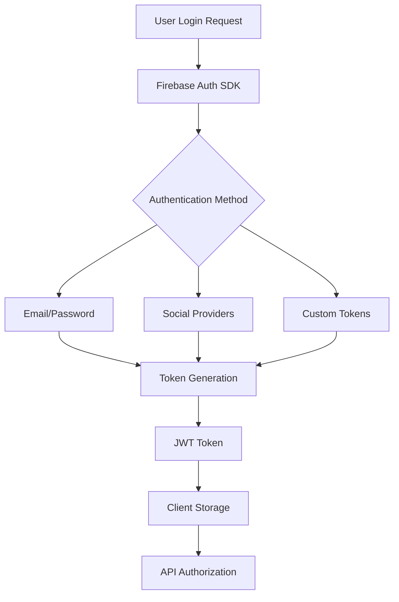
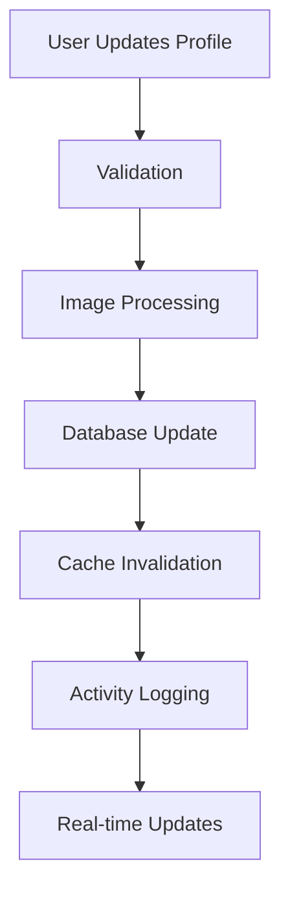

# Authentication and User Management Documentation

## Overview

PlayNite's authentication system provides secure, scalable user management with Firebase Authentication integration. The system supports multiple authentication methods, comprehensive user profiles, and robust security measures.

## Authentication Architecture

### Firebase Authentication Integration

**Authentication Flow**


**Supported Authentication Methods**
- **Email/Password**: Standard email-based authentication
- **Social Login**: OAuth integration (future enhancement)
- **Custom Tokens**: Programmatic authentication
- **Anonymous Auth**: Temporary anonymous access

### Authentication Service (`src/lib/auth.ts`)

**Key Features**
- **State Management**: Authentication state synchronization
- **Token Management**: JWT token refresh and validation
- **Error Handling**: Comprehensive error management
- **Security**: Secure token storage and transmission

**Auth Service Interface**
```typescript
interface AuthService {
  // Authentication Methods
  signIn(email: string, password: string): Promise<AuthUser>
  signUp(email: string, password: string): Promise<AuthUser>
  signOutUser(): Promise<void>

  // State Management
  onAuthStateChange(callback: (user: AuthUser | null) => void): () => void
  getCurrentUser(): Promise<AuthUser | null>

  // Token Management
  getIdToken(): Promise<string>
  refreshToken(): Promise<string>

  // User Management
  updateProfile(updates: Partial<AuthUser>): Promise<void>
  deleteAccount(): Promise<void>
}
```

## User Management System

### User Profile Architecture

**User Data Structure**
```typescript
interface AuthUser {
  uid: string;
  email: string;
  emailVerified: boolean;
  displayName?: string;
  photoURL?: string;
  phoneNumber?: string;
  createdAt: string;
  lastLoginAt: string;
  metadata: {
    creationTime: string;
    lastSignInTime: string;
  };
}

interface SocialUser {
  id: string;
  username: string;
  displayName: string;
  email: string;
  bio?: string;
  avatar?: string;
  coverImage?: string;
  verified: boolean;
  isPrivate: boolean;
  followersCount: number;
  followingCount: number;
  friendsCount: number;
  postsCount: number;
  likesCount: number;
  createdAt: Timestamp;
  updatedAt: Timestamp;
  preferences: UserPreferences;
  privacy: PrivacySettings;
  notifications: NotificationSettings;
}
```

### User Registration Flow

**Registration Process**
1. **Email Validation**: Format and uniqueness validation
2. **Password Strength**: Complexity requirements enforcement
3. **Profile Creation**: Initial user profile setup
4. **Email Verification**: Confirmation email sending
5. **Welcome Flow**: Onboarding process initiation

**Registration Validation Rules**
- **Email**: Valid format, unique, not disposable
- **Password**: Minimum 8 characters, mixed case, numbers, symbols
- **Username**: Unique, alphanumeric, length constraints
- **Profile**: Required fields validation

### User Profile Management

**Profile Update Workflow**


**Profile Features**
- **Avatar Management**: Image upload and processing
- **Cover Images**: Background image management
- **Bio Management**: Rich text bio with links
- **Privacy Settings**: Granular privacy controls
- **Notification Preferences**: Customizable notification settings

## Security Architecture

### Authentication Security

**Token Security**
- **JWT Storage**: Secure token storage strategies
- **Token Refresh**: Automatic token renewal
- **Token Validation**: Server-side token verification
- **Token Revocation**: Logout and security measures

**Security Measures**
- **Rate Limiting**: Login attempt throttling
- **Account Lockout**: Temporary lockout after failed attempts
- **Session Management**: Secure session handling
- **IP Tracking**: Suspicious activity monitoring

### Password Security

**Password Policies**
- **Minimum Length**: 8 characters minimum
- **Complexity**: Mixed case, numbers, special characters
- **History Tracking**: Prevent password reuse
- **Expiration**: Password aging policies (future)

**Password Recovery**
- **Secure Reset**: Time-limited reset tokens
- **Email Verification**: Secure email-based recovery
- **Rate Limiting**: Prevent abuse of reset system
- **Audit Trail**: Recovery attempt logging

## Authorization System

### Role-Based Access Control (RBAC)

**User Roles**
- **User**: Standard platform user
- **Verified User**: Email-verified user with enhanced features
- **Moderator**: Content moderation capabilities
- **Admin**: Full platform administration
- **Super Admin**: System-level administration

**Permission System**
```typescript
interface Permission {
  resource: string; // 'content', 'user', 'admin', etc.
  action: string;   // 'create', 'read', 'update', 'delete'
  scope: string;    // 'own', 'all', 'team', etc.
}

interface Role {
  id: string;
  name: string;
  permissions: Permission[];
  isSystem: boolean;
}
```

### Protected Routes & Middleware

**Route Protection**
- **Authentication Required**: Login-required pages
- **Role-based Access**: Admin-only sections
- **Permission-based**: Granular feature access
- **Conditional Rendering**: UI-based access control

**Middleware Architecture**
```typescript
// Authentication middleware
const requireAuth = (handler: Function) => async (req: Request) => {
  const token = await getToken({ req });
  if (!token) {
    return { redirect: '/login' };
  }
  return handler(req);
};

// Role-based middleware
const requireRole = (role: string) => (handler: Function) => async (req: Request) => {
  const token = await getToken({ req });
  const userRole = token?.role;
  if (userRole !== role) {
    return { redirect: '/unauthorized' };
  }
  return handler(req);
};
```

## Session Management

### Session Lifecycle

**Session States**
- **Active**: Valid authenticated session
- **Expired**: Session beyond timeout limit
- **Revoked**: Manually terminated session
- **Suspicious**: Flagged for security review

**Session Configuration**
- **Timeout**: Configurable session duration
- **Refresh**: Automatic token refresh before expiry
- **Persistence**: Cross-tab session synchronization
- **Cleanup**: Automatic cleanup of expired sessions

### Multi-Device Support

**Device Management**
- **Device Tracking**: Active device monitoring
- **Session Sync**: Cross-device state synchronization
- **Security Alerts**: New device notifications
- **Remote Logout**: Session termination from other devices

## User Preferences & Settings

### Notification Settings

**Notification Categories**
```typescript
interface NotificationSettings {
  global: {
    enabled: boolean;
    quietHours: {
      enabled: boolean;
      start: string; // HH:MM
      end: string;
      timezone: string;
    };
  };
  types: {
    likes: boolean;
    comments: boolean;
    follows: boolean;
    friendRequests: boolean;
    mentions: boolean;
    achievements: boolean;
    marketing: boolean;
  };
  channels: {
    inApp: boolean;
    push: boolean;
    email: boolean;
    sms: boolean;
  };
}
```

### Privacy Settings

**Privacy Controls**
```typescript
interface PrivacySettings {
  profile: {
    visibility: 'public' | 'friends' | 'private';
    showEmail: boolean;
    showPhone: boolean;
    showLastSeen: boolean;
    showActivity: boolean;
  };
  content: {
    defaultVisibility: 'public' | 'friends' | 'private';
    allowTagging: boolean;
    allowMentions: boolean;
    allowDuets: boolean;
  };
  social: {
    allowFriendRequests: boolean;
    allowFollowRequests: boolean;
    allowMessages: boolean;
    showOnlineStatus: boolean;
  };
  data: {
    allowAnalytics: boolean;
    allowPersonalization: boolean;
    allowThirdPartySharing: boolean;
  };
}
```

## User Onboarding & Lifecycle

### Onboarding Flow

**User Journey**
1. **Welcome**: Initial platform introduction
2. **Profile Setup**: Basic profile configuration
3. **Interest Selection**: Content preference setup
4. **Follow Suggestions**: Initial follows recommendation
5. **Tutorial**: Platform feature introduction
6. **Engagement**: Initial content interaction

**Onboarding Analytics**
- **Completion Rates**: Step-by-step completion tracking
- **Drop-off Points**: Identify friction points
- **Time to Value**: Measure time to first engagement
- **Feature Adoption**: Track feature usage post-onboarding

### User Lifecycle Management

**Lifecycle Stages**
- **New User**: First 30 days, high engagement focus
- **Active User**: Regular platform usage
- **At-risk User**: Declining engagement
- **Churned User**: Inactive for extended period
- **Reactivated User**: Returned after churn

**Lifecycle Interventions**
- **Welcome Series**: Automated welcome communications
- **Engagement Campaigns**: Targeted re-engagement
- **Win-back Campaigns**: Churn recovery efforts
- **Loyalty Programs**: Reward active users

## Admin User Management

### User Administration Tools

**Admin Features**
- **User Search**: Advanced user search and filtering
- **Bulk Operations**: Mass user management actions
- **Account Controls**: Suspend, ban, verify users
- **Data Export**: User data extraction tools
- **Audit Logs**: User activity monitoring

**User Moderation**
- **Content Flagging**: Review flagged user content
- **Behavior Monitoring**: Automated suspicious activity detection
- **Manual Review**: Admin-initiated user reviews
- **Escalation Process**: Multi-level moderation workflow

## Analytics & Monitoring

### User Analytics

**Key Metrics**
- **Acquisition**: Registration, source tracking
- **Activation**: First actions, feature adoption
- **Retention**: Login frequency, session duration
- **Engagement**: Content interaction, social activity
- **Monetization**: Premium features, conversion rates

**User Behavior Tracking**
- **Feature Usage**: Popular features identification
- **Content Preferences**: Interest and category analysis
- **Social Patterns**: Interaction and relationship analysis
- **Platform Journey**: User flow and navigation patterns

### Security Monitoring

**Security Metrics**
- **Failed Logins**: Authentication failure tracking
- **Suspicious Activity**: Unusual behavior detection
- **Account Takeovers**: Compromised account identification
- **Data Breaches**: Security incident monitoring

## Future Authentication Enhancements

### Planned Features
1. **Multi-Factor Authentication**: Enhanced security options
2. **Social Login Integration**: OAuth provider support
3. **Biometric Authentication**: Mobile biometric support
4. **Single Sign-On**: Enterprise SSO integration
5. **Passwordless Authentication**: Email/SMS-based login

### Technical Improvements
1. **Advanced Session Management**: Cross-platform session sync
2. **Enhanced Security**: Advanced threat detection
3. **Privacy Compliance**: GDPR and privacy regulation compliance
4. **Identity Federation**: Multi-platform identity management
5. **Advanced Analytics**: Detailed user behavior insights

---

*This authentication and user management documentation provides comprehensive insights into PlayNite's user system, covering security, privacy, lifecycle management, and administrative controls.*