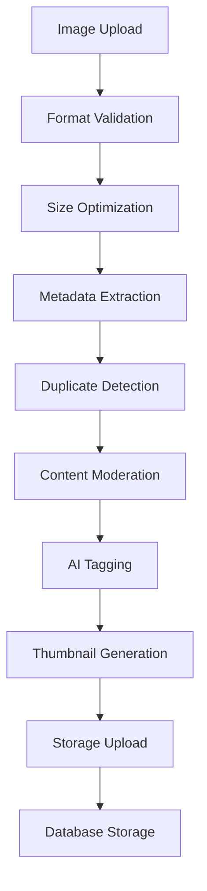
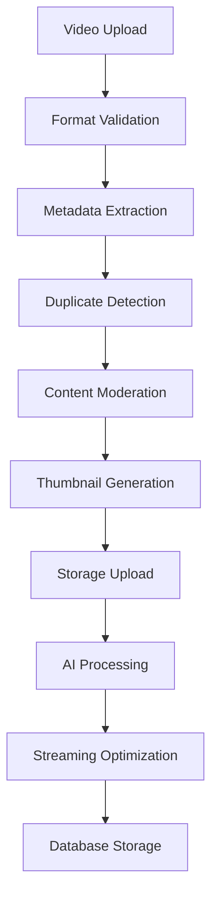
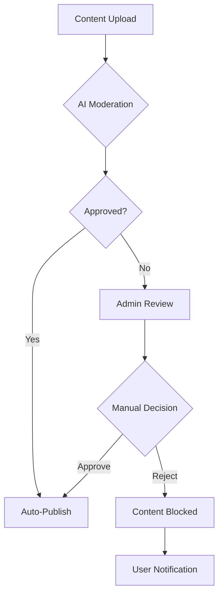
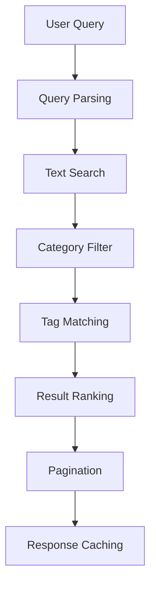
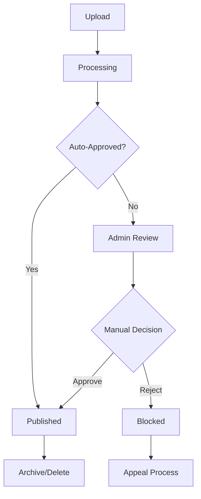

# Content Management System Documentation

## Overview

PlayNite's Content Management System (CMS) handles the complete lifecycle of digital content including images, videos, and stories. The system is designed for scalability, performance, and intelligent content processing.

## Content Types Architecture

### 1. Image Content System

#### Supported Formats
- **JPEG/JPG**: Standard photo format with compression
- **PNG**: Lossless format for graphics and screenshots
- **GIF**: Animated images with transparency support
- **WebP**: Modern format with superior compression

#### Image Processing Pipeline



**Processing Steps**:

1. **Validation**: File type, size (max 10MB), dimensions
2. **Optimization**: Quality-based compression (low/medium/high)
3. **Metadata Extraction**: Width, height, color profile, EXIF data
4. **Duplicate Detection**: AI-powered similarity checking
5. **Content Moderation**: Automated content filtering
6. **AI Processing**: Automatic tagging and categorization
7. **Thumbnail Generation**: Multiple size variants (400x400, 150x150)
8. **Storage**: Firebase Storage with CDN distribution
9. **Database**: Firestore document creation

#### Image Data Structure
```typescript
interface ImageData {
  id: string;
  userId: string;
  title?: string;
  description?: string;
  url: string;
  thumbnailUrl?: string;
  metadata: {
    width: number;
    height: number;
    size: number;
    format: string;
    colorProfile?: string;
    hasAlpha?: boolean;
  };
  tags: string[];
  category: string;
  isPublic: boolean;
  likesCount: number;
  commentsCount: number;
  viewsCount: number;
  bookmarksCount: number;
  createdAt: Timestamp;
  updatedAt: Timestamp;
}
```

### 2. Video Content System

#### Supported Formats
- **MP4**: H.264/H.265 standard format
- **WebM**: VP8/VP9 open format
- **MOV**: QuickTime format support
- **AVI**: Legacy format compatibility

#### Video Processing Pipeline



**Processing Steps**:

1. **Validation**: File type, size (max 100MB), duration limits
2. **Metadata Extraction**: Resolution, duration, codec, bitrate
3. **Duplicate Detection**: Video similarity analysis
4. **Content Moderation**: AI-powered content filtering
5. **Thumbnail Generation**: Multiple timestamp thumbnails
6. **Storage Upload**: Direct video file storage
7. **AI Processing**: Content analysis and tagging
8. **Streaming Optimization**: Quality adaptation setup
9. **Database Storage**: Video metadata persistence

#### Video Data Structure
```typescript
interface VideoData {
  id: string;
  userId: string;
  title?: string;
  description?: string;
  url: string;
  thumbnailUrl?: string;
  metadata: {
    width: number;
    height: number;
    duration: number;
    size: number;
    format: string;
    codec: string;
    bitrate: number;
    frameRate: number;
  };
  tags: string[];
  category: string;
  isPublic: boolean;
  likesCount: number;
  commentsCount: number;
  viewsCount: number;
  savesCount: number;
  watchTime: number;
  completionRate: number;
  createdAt: Timestamp;
  updatedAt: Timestamp;
}
```

### 3. Story Content System

#### Story Architecture
Stories are ephemeral content with a 24-hour lifecycle, designed for temporary sharing and engagement.

#### Story Features
- **Auto-Expiry**: Automatic deletion after 24 hours
- **Real-time Views**: Live view tracking and notifications
- **Segmentation**: Multiple media segments per story
- **Viewer Analytics**: Detailed view tracking and engagement

#### Story Data Structure
```typescript
interface StoryData {
  id: string;
  userId: string;
  segments: StorySegment[];
  expiresAt: Timestamp;
  isActive: boolean;
  viewsCount: number;
  uniqueViewsCount: number;
  engagementRate: number;
  createdAt: Timestamp;
}

interface StorySegment {
  id: string;
  type: 'image' | 'video';
  url: string;
  thumbnailUrl?: string;
  duration?: number; // For video segments
  text?: string; // Optional overlay text
  order: number;
}
```

## Content Upload Architecture

### Upload Progress Tracking
```typescript
interface UploadProgress {
  loaded: number;
  total: number;
  percentage: number;
  status: 'pending' | 'uploading' | 'processing' | 'completed' | 'error' | 'cancelled' | 'paused';
  error?: string;
}

interface UploadFile {
  id: string;
  file: File;
  type: 'image' | 'video';
  progress: UploadProgress;
  preview?: string;
  thumbnail?: string;
  metadata?: ContentMetadata;
}
```

### Batch Upload System
- **Concurrent Uploads**: Limited to 3 simultaneous uploads
- **Queue Management**: Automatic queuing for large batches
- **Progress Aggregation**: Combined progress tracking
- **Error Recovery**: Individual file error handling

## Content Moderation System

### AI-Powered Moderation
1. **Image Classification**: NSFW detection, violence, hate symbols
2. **Text Analysis**: Comment and description moderation
3. **Video Analysis**: Frame-by-frame content scanning
4. **Spam Detection**: Duplicate and spam content identification

### Moderation Workflow


## Content Storage Architecture

### Firebase Storage Organization
```
storage/
├── images/
│   ├── original/
│   │   ├── {userId}/
│   │   │   ├── {contentId}.{ext}
│   ├── thumbnails/
│   │   ├── 400x400/
│   │   ├── 150x150/
│   └── optimized/
│       ├── webp/
│       └── compressed/
├── videos/
│   ├── original/
│   │   ├── {userId}/
│   │   │   ├── {contentId}.{ext}
│   ├── thumbnails/
│   │   ├── {contentId}_thumb.jpg
│   └── streams/
│       └── {contentId}_playlist.m3u8
└── stories/
    └── {userId}/
        └── {storyId}/
            ├── segment1.jpg
            └── segment2.mp4
```

### CDN Integration
- **Global Distribution**: Automatic CDN replication
- **Cache Headers**: Optimized cache control headers
- **Access Control**: Signed URLs for private content
- **Compression**: Automatic gzip/brotli compression

## Content Retrieval & Caching

### API Endpoints
```typescript
// Content Retrieval
GET /api/content/images          // List images with filters
GET /api/content/images/:id      // Get specific image
GET /api/content/videos          // List videos with filters
GET /api/content/videos/:id      // Get specific video
GET /api/content/stories         // List active stories
GET /api/content/feed            // Combined content feed
GET /api/content/trending        // Trending content
GET /api/content/recommended     // AI-recommended content
```

### Caching Strategy
- **Short-term**: 1-5 minutes for dynamic content (stories, feed)
- **Medium-term**: 10-30 minutes for user-specific content
- **Long-term**: 1-24 hours for static content (images, videos)

### Database Query Optimization
```typescript
// Efficient queries with proper indexing
const imagesQuery = query(
  collection(db, 'images'),
  where('isPublic', '==', true),
  where('category', '==', 'photos'),
  orderBy('createdAt', 'desc'),
  limit(20)
);
```

## Content Analytics & Metrics

### Engagement Tracking
- **Views**: Content view counting and tracking
- **Likes**: Like/unlike interactions with rate limiting
- **Comments**: Comment creation and nested reply tracking
- **Shares**: Content sharing across platforms
- **Bookmarks**: User bookmark collections
- **Watch Time**: Video completion and engagement metrics

### Performance Metrics
- **Load Times**: Image/video loading performance
- **Error Rates**: Upload and playback failure tracking
- **Quality Metrics**: Video quality adaptation success
- **Storage Usage**: Content storage consumption trends

## Content Search & Discovery

### Search Features
- **Text Search**: Title, description, and tag search
- **Category Filtering**: Content type and category filters
- **User Search**: Photographer/creator discovery
- **Tag-based Search**: Hashtag and keyword exploration
- **Location Search**: Geographic content discovery (future)

### Search Architecture


### AI-Powered Recommendations
1. **Collaborative Filtering**: User behavior analysis
2. **Content-based Filtering**: Content similarity matching
3. **Trending Detection**: Engagement-based trending calculation
4. **Personalization**: User preference learning

## Content Lifecycle Management

### Content States
- **Draft**: Content being processed
- **Published**: Publicly available content
- **Private**: User-only accessible content
- **Archived**: Hidden but preserved content
- **Deleted**: Soft-deleted with recovery option
- **Blocked**: Admin-moderated content

### State Transition Workflow


## Performance Optimizations

### Image Optimizations
- **Responsive Images**: Multiple size variants
- **WebP Conversion**: Modern format optimization
- **Lazy Loading**: Progressive image loading
- **Progressive JPEG**: Faster initial loading
- **CDN Optimization**: Global edge caching

### Video Optimizations
- **Adaptive Streaming**: Quality adaptation based on bandwidth
- **Progressive Loading**: Start playing before full download
- **Thumbnail Previews**: Quick visual reference
- **Background Preloading**: Next video preparation
- **Error Recovery**: Automatic retry on failures

## Admin Content Management

### Admin Dashboard Features
- **Content Review Queue**: Pending moderation items
- **Bulk Operations**: Mass content management
- **Analytics Dashboard**: Platform usage metrics
- **User Management**: Content creator oversight
- **SEO Management**: Search optimization tools

### Moderation Tools
- **Content Flagging**: User-reported content review
- **Automated Actions**: Bulk approval/rejection
- **Content Categories**: Organized review workflows
- **Appeal System**: User content dispute resolution

## Future Enhancements

### Planned Features
1. **Advanced Video Editing**: In-browser video editing tools
2. **AR/VR Content**: Immersive content support
3. **Live Streaming**: Real-time video broadcasting
4. **Content Collections**: User-curated content sets
5. **Advanced Analytics**: Detailed engagement insights

### Technical Improvements
1. **Multi-CDN Support**: Enhanced global delivery
2. **Advanced Compression**: Next-generation compression algorithms
3. **Blockchain Integration**: Content authenticity verification
4. **AI Enhancement**: Advanced computer vision features
5. **Real-time Collaboration**: Multi-user content creation

---

*This content management system documentation provides comprehensive insights into how PlayNite handles digital content from upload to consumption, ensuring optimal performance, security, and user experience.*