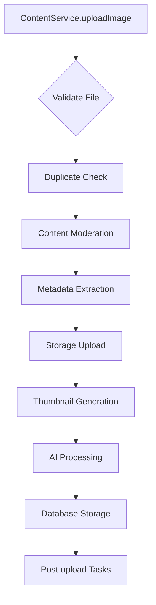
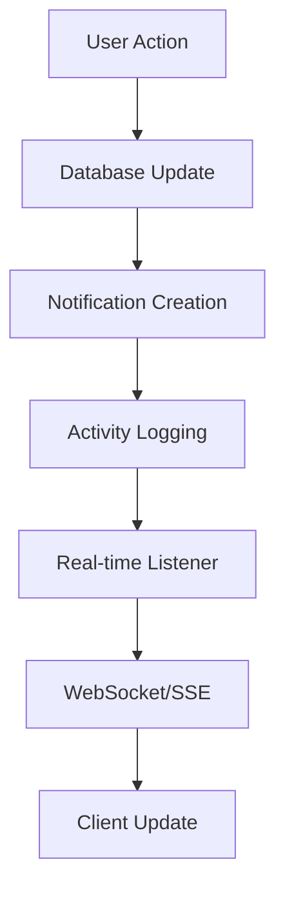
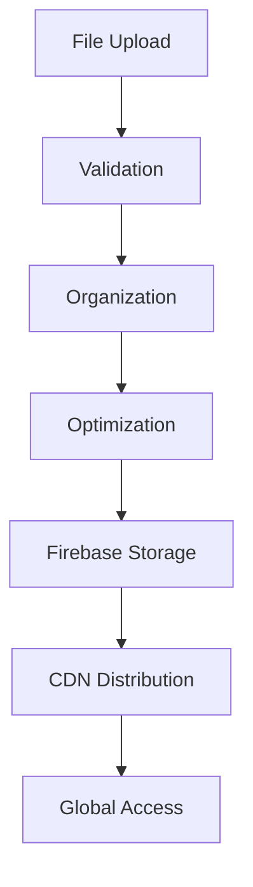

# Service Architecture Documentation

## Overview

PlayNite's service layer implements a modular, scalable architecture that separates business logic from presentation concerns. Each service follows the Single Responsibility Principle and communicates through well-defined interfaces.

## Core Service Architecture

### Service Layer Structure

```
┌─────────────────────────────────────────────────────────────┐
│                    Service Layer                           │
├─────────────────────────────────────────────────────────────┤
│  ┌─────────────────┐  ┌─────────────────┐  ┌─────────────────┐ │
│  │  ContentService │  │  SocialService  │  │ StorageService  │ │
│  │                 │  │                 │  │                 │ │
│  │ • Upload        │  │ • Follow        │  │ • File Upload   │ │
│  │ • Processing    │  │ • Friends       │  │ • Storage       │ │
│  │ • Moderation    │  │ • Comments      │  │ • Retrieval     │ │
│  │ • Search        │  │ • Notifications │  │ • Organization  │ │
│  └─────────────────┘  └─────────────────┘  └─────────────────┘ │
├─────────────────────────────────────────────────────────────┤
│  ┌─────────────────┐  ┌─────────────────┐  ┌─────────────────┐ │
│  │   VideoSvc      │  │   AuthSvc       │  │  NotificationSvc │ │
│  │                 │  │                 │  │                 │ │
│  │ • Streaming     │  │ • Auth          │  │ • Real-time     │ │
│  │ • Management    │  │ • Middleware    │  │ • Push          │ │
│  │ • Analytics     │  │ • Validation    │  │ • Management    │ │
│  └─────────────────┘  └─────────────────┘  └─────────────────┘ │
└─────────────────────────────────────────────────────────────┘
```

## Service Interaction Patterns

### 1. ContentService (`src/lib/services/content-service.ts`)

**Primary Responsibility**: Content lifecycle management and processing

#### Key Methods & Interactions

```typescript
class ContentService {
  // Upload Methods
  async uploadImage(file: File, options: UploadOptions): Promise<UploadResult>
  async uploadVideo(file: File, options: UploadOptions): Promise<UploadResult>
  async uploadMultipleFiles(files: File[], options: UploadOptions): Promise<UploadResult[]>

  // Content Retrieval
  async getImages(filters?: ContentFilters): Promise<PaginatedResponse<ImageData>>
  async getVideos(filters?: ContentFilters): Promise<PaginatedResponse<VideoData>>
  async getStories(filters?: ContentFilters): Promise<PaginatedResponse<StoryData>>

  // Social Interactions
  async likeImage(imageId: string): Promise<ApiResponse<{ liked: boolean; likes: number }>>
  async bookmarkImage(imageId: string): Promise<ApiResponse<{ bookmarked: boolean }>>
}
```

#### Service Dependencies
- **StorageService**: File upload and retrieval
- **ContentModerationService**: Content validation and AI processing
- **PostUploadService**: Post-upload processing tasks
- **SocialService**: Like and bookmark interactions

#### Upload Workflow Integration


### 2. SocialService (`src/lib/services/social-service.ts`)

**Primary Responsibility**: Social interaction management and real-time features

#### Core Features

**User Management**
- Profile updates with activity logging
- User search and discovery
- Verification status management

**Follow System**
- Follow/unfollow with count updates
- Follower/following queries with pagination
- Real-time follow notifications

**Friendship System**
- Friend request workflow (send/accept/decline)
- Friendship status management
- Close friend designations

**Comment System**
- Nested comment creation and retrieval
- Comment moderation and approval
- Like/unlike comments
- Hashtag extraction and linking

**Notification System**
- Multi-channel notifications (in-app, push, email)
- Notification preferences and quiet hours
- Real-time notification delivery
- Notification grouping and priority

#### Real-time Architecture



**Subscription Management**
```typescript
// Real-time subscriptions
subscribeToUserUpdates(userId: string, callback: Function): () => void
subscribeToNotifications(userId: string, callback: Function): () => void
subscribeToContentUpdates(contentType: string, callback: Function): () => void
```

### 3. StorageService (`src/lib/services/storage-service.ts`)

**Primary Responsibility**: File storage, retrieval, and optimization

#### Key Operations

**File Upload Process**
1. **Validation**: File type, size, and security checks
2. **Organization**: Folder structure and naming conventions
3. **Optimization**: Image compression and format conversion
4. **Upload**: Progress tracking and error handling
5. **Metadata**: Storage metadata and access controls

**Storage Architecture**


### 4. Video Services

#### VideoStreamingService
**Primary Responsibility**: Video streaming and quality adaptation

**Features**:
- Progressive video loading
- Quality adaptation based on bandwidth
- Streaming analytics and metrics
- Error recovery and retry logic

#### VideoManagementService
**Primary Responsibility**: Video processing and metadata management

**Features**:
- Video format conversion and optimization
- Metadata extraction (duration, resolution, codec)
- Thumbnail generation at multiple timestamps
- Video segmentation for efficient loading

#### VideoAnalyticsService
**Primary Responsibility**: Video performance and engagement tracking

**Features**:
- View tracking and completion rates
- Quality switching analytics
- User engagement metrics
- Performance optimization recommendations

### 5. NotificationService (`src/lib/services/notification-service.ts`)

**Primary Responsibility**: Multi-channel notification delivery

#### Notification Channels
- **In-App**: Real-time UI notifications
- **Push**: Browser/mobile push notifications
- **Email**: HTML email notifications (future)
- **SMS**: Text notifications (future)

#### Notification Types
```typescript
interface Notification {
  id: string;
  userId: string;
  type: 'like' | 'comment' | 'follow' | 'friend_request' | 'mention' | 'achievement';
  title: string;
  message: string;
  data: Record<string, any>;
  isRead: boolean;
  createdAt: string;
  priority: 'low' | 'normal' | 'high' | 'urgent';
  category: 'social' | 'achievement' | 'system' | 'marketing';
}
```

## Service Communication Patterns

### 1. Direct Service Injection
```typescript
// ContentService uses multiple services directly
class ContentService {
  constructor(
    private storageService = storageService,
    private moderationService = contentModerationService,
    private uploadService = postUploadService
  ) {}

  async uploadImage(file: File): Promise<UploadResult> {
    // Use injected services
    const moderation = await this.moderationService.moderateContent(file);
    const upload = await this.storageService.uploadFile(file);
    // ... process result
  }
}
```

### 2. Event-Driven Communication
```typescript
// Services emit events for decoupled communication
class PostUploadService {
  async processAfterUpload(contentId: string, data: any) {
    // Emit events for other services to handle
    eventEmitter.emit('content.uploaded', { contentId, data });
    eventEmitter.emit('analytics.track', { action: 'upload', contentId });
  }
}
```

### 3. Shared Data Patterns
```typescript
// Services coordinate through shared data structures
interface UploadProgress {
  id: string;
  status: 'pending' | 'uploading' | 'processing' | 'completed' | 'error';
  progress: number;
  error?: string;
}

// Multiple services update the same progress object
const updateProgress = (uploadFile: UploadFile, progress: Partial<UploadProgress>) => {
  Object.assign(uploadFile.progress, progress);
  // Notify UI of progress changes
};
```

## Error Handling Patterns

### 1. Service-Level Error Handling
```typescript
class BaseService {
  protected handleError(error: any, context: string): never {
    console.error(`[${context}] Service error:`, error);

    // Transform errors for consistent API
    if (error.code === 'PERMISSION_DENIED') {
      throw new ServiceError('Access denied', 'ACCESS_DENIED', 403);
    }

    throw new ServiceError('Internal error', 'INTERNAL_ERROR', 500);
  }
}
```

### 2. Retry Logic
```typescript
class RetryableService {
  async withRetry<T>(operation: () => Promise<T>, maxRetries = 3): Promise<T> {
    for (let i = 0; i < maxRetries; i++) {
      try {
        return await operation();
      } catch (error) {
        if (i === maxRetries - 1) throw error;

        // Exponential backoff
        await new Promise(resolve => setTimeout(resolve, Math.pow(2, i) * 1000));
      }
    }
  }
}
```

## Performance Optimization Patterns

### 1. Caching Strategy
```typescript
class CachedService {
  private cache = new Map<string, { data: any; timestamp: number; ttl: number }>();

  async getCached<T>(key: string, fetcher: () => Promise<T>, ttl = 300000): Promise<T> {
    const cached = this.cache.get(key);

    if (cached && Date.now() - cached.timestamp < cached.ttl) {
      return cached.data;
    }

    const data = await fetcher();
    this.cache.set(key, { data, timestamp: Date.now(), ttl });
    return data;
  }
}
```

### 2. Batch Operations
```typescript
class BatchService {
  async batchLike(contentIds: string[], contentType: string) {
    // Batch multiple operations for efficiency
    const batch = writeBatch(db);
    contentIds.forEach(id => {
      const ref = doc(db, `${contentType}s`, id);
      batch.update(ref, { likesCount: increment(1) });
    });
    await batch.commit();
  }
}
```

## Testing Patterns

### 1. Service Mocking
```typescript
// Mock external dependencies for testing
const mockStorageService = {
  uploadFile: jest.fn(),
  getFileUrl: jest.fn(),
};

const contentService = new ContentService(mockStorageService);
```

### 2. Integration Testing
```typescript
describe('ContentService Integration', () => {
  it('should complete full upload workflow', async () => {
    const file = createMockFile();
    const result = await contentService.uploadImage(file);

    expect(result.status).toBe('success');
    expect(mockStorageService.uploadFile).toHaveBeenCalled();
    expect(mockModerationService.moderateContent).toHaveBeenCalled();
  });
});
```

## Monitoring & Observability

### 1. Service Metrics
```typescript
class MonitoredService {
  private metrics = {
    operations: 0,
    errors: 0,
    averageResponseTime: 0,
  };

  async monitoredOperation<T>(name: string, operation: () => Promise<T>): Promise<T> {
    const start = Date.now();
    this.metrics.operations++;

    try {
      const result = await operation();
      const duration = Date.now() - start;
      this.metrics.averageResponseTime =
        (this.metrics.averageResponseTime + duration) / 2;

      return result;
    } catch (error) {
      this.metrics.errors++;
      throw error;
    }
  }
}
```

### 2. Health Checks
```typescript
class HealthCheckService {
  async checkServiceHealth(serviceName: string): Promise<ServiceHealth> {
    const checks = {
      database: await this.checkDatabase(),
      storage: await this.checkStorage(),
      externalApis: await this.checkExternalApis(),
    };

    return {
      service: serviceName,
      status: Object.values(checks).every(c => c.status === 'healthy') ? 'healthy' : 'unhealthy',
      checks,
      timestamp: new Date().toISOString(),
    };
  }
}
```

## Deployment Considerations

### Service Dependencies
- **Firebase Services**: Authentication, Firestore, Storage
- **External APIs**: AI services, analytics platforms
- **CDN Services**: Global content delivery
- **Monitoring Services**: Performance and error tracking

### Scalability Patterns
- **Stateless Services**: No local state, horizontal scaling
- **Async Processing**: Background job processing for heavy operations
- **Circuit Breakers**: Prevent cascade failures
- **Load Balancing**: Distribute requests across service instances

## Future Enhancements

### Planned Improvements
1. **Service Mesh**: Istio or similar for service communication
2. **Event Sourcing**: Event-driven architecture for better traceability
3. **GraphQL Layer**: Unified API layer over REST services
4. **Service Discovery**: Dynamic service registration and discovery
5. **Distributed Tracing**: End-to-end request tracing across services

### Microservices Evolution
- **Content Microservice**: Dedicated content processing service
- **Social Microservice**: Social interaction handling
- **Media Microservice**: Video/audio processing and streaming
- **Analytics Microservice**: Metrics collection and analysis

---

*This service architecture documentation provides detailed insights into how PlayNite's service layer is designed, implemented, and maintained for scalability and reliability.*