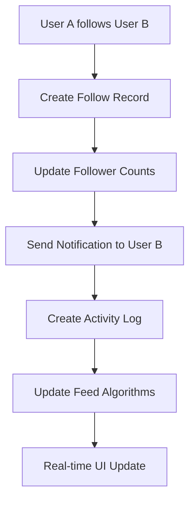
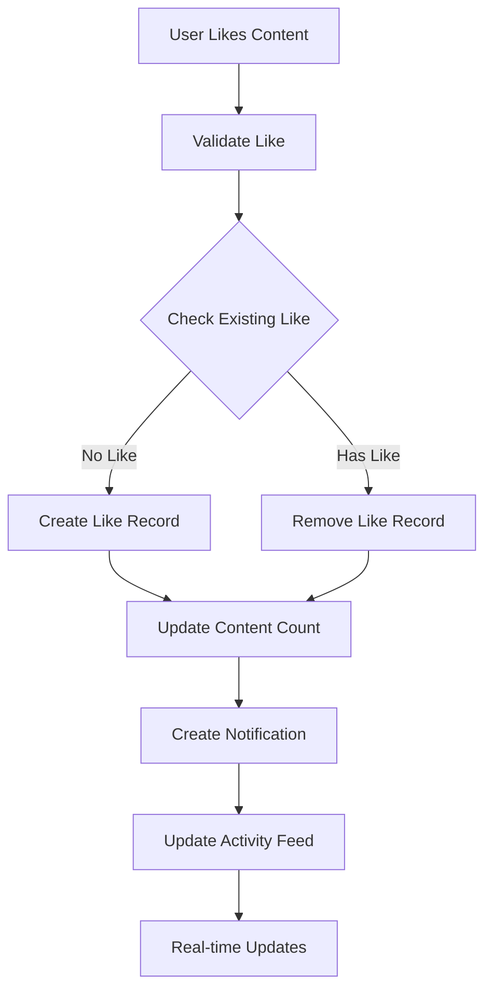
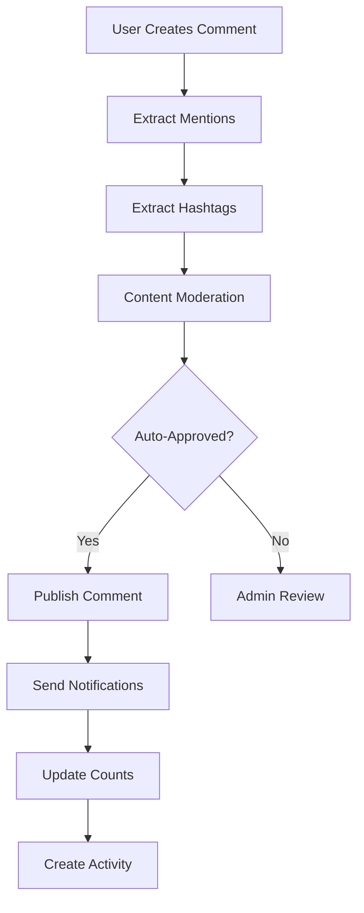

# Social Features Architecture Documentation

## Overview

PlayNite's social features form a comprehensive social networking ecosystem that enables user interaction, content engagement, and community building. The architecture supports real-time interactions, complex relationship management, and scalable notification systems.

## Core Social Features

### 1. User Relationship Management

#### Follow System Architecture

**Follow Data Structure**
```typescript
interface Follow {
  id: string;
  followerId: string;
  followingId: string;
  createdAt: string;
  status: 'active' | 'pending' | 'blocked';
  notificationSettings?: {
    newContent: boolean;
    likes: boolean;
    comments: boolean;
  };
}
```

**Follow Workflow**


**Key Operations**:
- **Follow**: Create follow relationship with validation
- **Unfollow**: Remove relationship and update counts
- **Get Followers**: Paginated follower list with user data
- **Get Following**: Paginated following list with user data
- **Count Updates**: Atomic count updates using Firestore increments

#### Friendship System Architecture

**Friend Request Workflow**
```typescript
interface FriendRequest {
  id: string;
  senderId: string;
  receiverId: string;
  status: 'pending' | 'accepted' | 'declined' | 'cancelled';
  createdAt: string;
  respondedAt?: string;
  message?: string;
}

interface Friendship {
  id: string;
  user1Id: string;
  user2Id: string;
  status: 'active' | 'blocked';
  createdAt: string;
  closeFriend: boolean;
  interactionScore: number;
}
```

**Friendship States**
- **Pending**: Request sent but not responded
- **Accepted**: Mutual friendship established
- **Declined**: Request rejected by receiver
- **Blocked**: Friendship terminated
- **Close Friend**: Special designation for closer relationships

### 2. Content Interaction System

#### Like System Architecture

**Like Operations**
- **Like Content**: Create like interaction across content types
- **Unlike Content**: Remove like interaction
- **Batch Like**: Multiple content likes in single operation
- **Like Validation**: Prevent duplicate likes and spam

**Like Data Flow**


#### Comment System Architecture

**Comment Structure**
```typescript
interface Comment {
  id: string;
  contentId: string;
  contentType: 'image' | 'video' | 'post';
  authorId: string;
  text: string;
  parentId?: string; // For nested replies
  mentions: string[]; // User IDs mentioned in comment
  hashtags: string[]; // Extracted hashtags
  likesCount: number;
  repliesCount: number;
  createdAt: string;
  updatedAt: string;
  edited: boolean;
  isApproved: boolean;
  isReported: boolean;
  reportsCount: number;
}
```

**Comment Features**
- **Nested Replies**: Multi-level comment threads
- **Mention System**: @username notifications
- **Hashtag Extraction**: Automatic hashtag detection
- **Moderation Queue**: Admin approval workflow
- **Edit History**: Comment edit tracking
- **Like/Replies**: Engagement tracking

**Comment Workflow**


### 3. Notification System Architecture

#### Notification Types & Categories

**Notification Classification**
```typescript
type NotificationType =
  | 'like' | 'comment' | 'follow' | 'friend_request'
  | 'mention' | 'tag' | 'share' | 'achievement'
  | 'system' | 'milestone';

type NotificationCategory =
  | 'social' | 'achievement' | 'system' | 'marketing';

type NotificationPriority =
  | 'low' | 'normal' | 'high' | 'urgent';
```

**Notification Data Structure**
```typescript
interface Notification {
  id: string;
  userId: string;
  type: NotificationType;
  title: string;
  message: string;
  data: Record<string, any>; // Context-specific data
  isRead: boolean;
  readAt?: string;
  createdAt: string;
  priority: NotificationPriority;
  category: NotificationCategory;
  isGrouped: boolean;
  groupId?: string; // For grouping similar notifications
  channels: {
    inApp: boolean;
    push: boolean;
    email: boolean;
    sms?: boolean;
  };
  preferences: {
    allowPreview: boolean;
    allowSound: boolean;
    allowVibration: boolean;
    quietHours: {
      enabled: boolean;
      start: string; // HH:MM format
      end: string;
    };
  };
  expiresAt?: string; // For temporary notifications
}
```

#### Multi-Channel Delivery

**In-App Notifications**
- Real-time UI notifications
- Notification center with filtering
- Read/unread status tracking
- Batch mark as read operations

**Push Notifications**
- Browser push notification support
- Mobile push notification integration (future)
- Permission management
- Delivery tracking and analytics

**Email Notifications** (Future)
- HTML email templates
- Unsubscribe management
- Delivery optimization

#### Notification Preferences
```typescript
interface NotificationPreferences {
  global: {
    enabled: boolean;
    quietHours: {
      enabled: boolean;
      start: string;
      end: string;
      timezone: string;
    };
  };
  types: {
    likes: boolean;
    comments: boolean;
    follows: boolean;
    friendRequests: boolean;
    mentions: boolean;
    achievements: boolean;
    system: boolean;
  };
  channels: {
    inApp: boolean;
    push: boolean;
    email: boolean;
  };
}
```

### 4. Activity Feed System

#### Activity Types
```typescript
interface Activity {
  id: string;
  userId: string;
  type: 'post' | 'like' | 'comment' | 'follow' | 'share' | 'achievement';
  contentId?: string;
  contentType?: 'image' | 'video' | 'post';
  metadata: Record<string, any>;
  createdAt: string;
  visibility: 'public' | 'friends' | 'private';
  engagementScore: number;
}
```

**Activity Feed Generation**
- **Algorithm-based**: Machine learning content ranking
- **Chronological**: Time-based activity ordering
- **Hybrid**: Combination of relevance and recency
- **Personalized**: User preference-based filtering

**Feed Performance Optimization**
- **Pagination**: Efficient data loading
- **Caching**: Redis-based feed caching
- **Pre-computation**: Background feed preparation
- **Real-time Updates**: Live feed updates without full refresh

### 5. Real-time Features Architecture

#### Real-time Communication Patterns

**Firebase Real-time Database Integration**
- Live user presence tracking
- Real-time notification delivery
- Live follower count updates
- Real-time comment updates

**Subscription Management**
```typescript
interface SocialSubscription {
  id: string;
  userId: string;
  type: 'user_updates' | 'notifications' | 'feed' | 'content';
  callback: (update: SocialRealtimeUpdate) => void;
  filters?: Record<string, any>;
}

interface SocialRealtimeUpdate<T = any> {
  type: 'create' | 'update' | 'delete';
  data: T;
  timestamp: string;
  userId?: string;
  contentId?: string;
}
```

**Subscription Lifecycle**
1. **Subscribe**: Establish real-time connection
2. **Filter**: Apply user-specific filters
3. **Listen**: Receive real-time updates
4. **Process**: Transform updates for UI consumption
5. **Unsubscribe**: Clean up connections

#### WebSocket Alternatives
- **Firebase Real-time Listeners**: Primary real-time solution
- **Server-Sent Events**: Fallback for one-way communication
- **WebSocket**: Future enhancement for bidirectional communication
- **Polling**: Graceful degradation for older browsers

## Social Analytics & Insights

### Engagement Metrics
- **Interaction Rates**: Like, comment, share rates
- **Reach Metrics**: Content visibility and exposure
- **Growth Metrics**: Follower and friend acquisition
- **Retention Metrics**: User engagement over time

### Social Graph Analysis
- **Influence Scoring**: User influence calculation
- **Connection Strength**: Relationship quality assessment
- **Community Detection**: User group identification
- **Content Affinity**: Interest-based user clustering

## Privacy & Security

### Privacy Controls
- **Content Visibility**: Public, friends-only, private settings
- **Interaction Privacy**: Who can like, comment, share
- **Profile Visibility**: Public profile vs private account
- **Data Sharing**: Third-party data sharing controls

### Security Measures
- **Rate Limiting**: Prevent spam and abuse
- **Content Filtering**: Automated harmful content detection
- **User Verification**: Account verification system
- **Data Encryption**: Sensitive data protection

## Performance Optimizations

### Database Optimization
- **Efficient Queries**: Proper indexing and query structure
- **Batch Operations**: Multiple updates in single transaction
- **Count Optimization**: Separate count collections for performance
- **Cache Strategy**: Intelligent caching with TTL

### Real-time Performance
- **Connection Pooling**: Efficient connection management
- **Message Batching**: Batch similar updates
- **Selective Updates**: Only send necessary data
- **Compression**: Minimize payload size

## Social Features Integration

### Cross-Feature Dependencies

**Content + Social Integration**
- Content likes and comments
- Social sharing of content
- User tagging in content
- Content-based user recommendations

**Notification + Activity Integration**
- Activity-driven notifications
- Notification-based activity creation
- Cross-platform notification delivery
- Notification preference management

**Real-time + Social Integration**
- Live follower count updates
- Real-time comment notifications
- Live activity feed updates
- Real-time presence indicators

## Admin Social Management

### Moderation Tools
- **Comment Moderation**: Approve/reject user comments
- **User Management**: Block/suspend problematic users
- **Content Flagging**: Review flagged social content
- **Analytics Dashboard**: Social engagement monitoring

### Community Management
- **User Reporting**: Handle user reports and disputes
- **Community Guidelines**: Enforce platform rules
- **Crisis Management**: Handle emergency situations
- **Trend Monitoring**: Track platform-wide trends

## Future Social Enhancements

### Planned Features
1. **Advanced Groups**: Interest-based user communities
2. **Live Features**: Real-time video chat and streaming
3. **AR Social**: Augmented reality social interactions
4. **Social Commerce**: In-platform purchasing and selling
5. **Enhanced Discovery**: AI-powered user and content discovery

### Technical Improvements
1. **Graph Database**: Advanced relationship modeling
2. **Machine Learning**: Enhanced recommendation algorithms
3. **Real-time Analytics**: Live social metrics
4. **Advanced Privacy**: Granular privacy controls
5. **Cross-platform Sync**: Multi-device social state sync

---

*This social features architecture documentation provides comprehensive insights into PlayNite's social ecosystem, covering relationship management, content interaction, real-time features, and community building capabilities.*