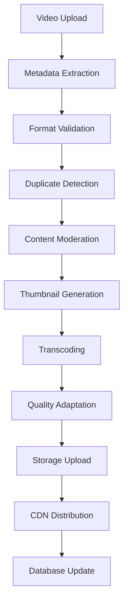

# Video Streaming and Management Architecture

## Overview

PlayNite's video streaming system provides high-performance, scalable video delivery with adaptive quality, comprehensive analytics, and seamless user experience across devices and network conditions.

## Video Streaming Architecture

### Core Streaming Components

```
┌─────────────────────────────────────────────────────────────────┐
│                    Video Streaming System                      │
├─────────────────────────────────────────────────────────────────┤
│  ┌─────────────────┐  ┌─────────────────┐  ┌─────────────────┐ │
│  │  Upload &       │  │  Processing     │  │  Streaming      │ │
│  │  Management     │  │  Pipeline       │  │  Delivery       │ │
│  │                 │  │                 │  │                 │ │
│  │ • Validation    │  │ • Transcoding   │  │ • Adaptive      │ │
│  │ • Storage       │  │ • Optimization  │  │ • Quality       │ │
│  │ • Metadata      │  │ • Thumbnails    │  │ • Analytics     │ │
│  └─────────────────┘  └─────────────────┘  └─────────────────┘ │
├─────────────────────────────────────────────────────────────────┤
│  ┌─────────────────┐  ┌─────────────────┐  ┌─────────────────┐ │
│  │  Video Player   │  │  CDN & Cache    │  │  Analytics      │ │
│  │                 │  │                 │  │                 │ │
│  │ • Progressive   │  │ • Global        │  │ • Performance   │ │
│  │ • Adaptive      │  │ • Edge Caching  │  │ • Engagement    │ │
│  │ • Error Recovery│  │ • Optimization  │  │ • Quality       │ │
│  └─────────────────┘  └─────────────────┘  └─────────────────┘ │
└─────────────────────────────────────────────────────────────────┘
```

## Video Upload and Processing

### Upload Architecture

**Supported Video Formats**
- **MP4**: H.264/H.265 (Primary format)
- **WebM**: VP8/VP9 (Web-optimized)
- **MOV**: QuickTime (Mobile/iOS)
- **AVI**: Legacy compatibility

**Upload Validation**
```typescript
interface VideoValidation {
  format: string[];
  maxSize: number; // 100MB limit
  maxDuration: number; // 10 minutes max
  minResolution: { width: number; height: number };
  allowedCodecs: string[];
}
```

**Upload Progress Tracking**
```typescript
interface VideoUploadProgress {
  id: string;
  fileName: string;
  fileSize: number;
  uploadedBytes: number;
  status: 'pending' | 'uploading' | 'processing' | 'completed' | 'error';
  progress: number; // 0-100
  currentStep: string;
  estimatedTimeRemaining?: number;
  error?: string;
}
```

### Video Processing Pipeline

**Processing Stages**
1. **Metadata Extraction**: Resolution, duration, codec analysis
2. **Format Optimization**: Codec and container optimization
3. **Quality Adaptation**: Multiple bitrate versions
4. **Thumbnail Generation**: Multiple timestamp thumbnails
5. **Segmentation**: Video chunking for streaming
6. **Storage Organization**: Optimized file placement

**Processing Workflow**


## Streaming Technology Stack

### Adaptive Bitrate Streaming

**Streaming Protocols**
- **HLS (HTTP Live Streaming)**: Apple-standard streaming
- **DASH (Dynamic Adaptive Streaming)**: Web-standard streaming
- **Progressive Download**: Fallback for older browsers

**Quality Adaptation**
```typescript
interface StreamingQuality {
  resolution: string; // 480p, 720p, 1080p, 4K
  bitrate: number;    // kbps
  fps: number;        // frames per second
  codec: string;      // H.264, H.265, VP9
}

interface AdaptiveStreaming {
  qualities: StreamingQuality[];
  autoSwitch: boolean;
  userSelectedQuality?: string;
  bandwidthEstimation: number;
  bufferHealth: number;
}
```

### Video Player Architecture (`src/components/ui/video-player.tsx`)

**Player Features**
- **Progressive Loading**: Start playing before full download
- **Quality Adaptation**: Automatic quality switching
- **Error Recovery**: Automatic retry on failures
- **Fullscreen Support**: Native fullscreen API
- **Playback Controls**: Custom control interface
- **Analytics Integration**: Performance and engagement tracking

**Player State Management**
```typescript
interface VideoPlayerState {
  isPlaying: boolean;
  currentTime: number;
  duration: number;
  volume: number;
  isMuted: boolean;
  playbackRate: number;
  quality: string;
  isFullscreen: boolean;
  isLoading: boolean;
  error?: string;
  bufferedRanges: TimeRanges;
}
```

## Content Delivery Network (CDN) Integration

### CDN Architecture

**Global Distribution**
- **Edge Locations**: 50+ global edge servers
- **Cache Strategy**: Multi-level caching hierarchy
- **Load Balancing**: Intelligent traffic distribution
- **Failover**: Automatic failover to healthy nodes

**Caching Strategy**
- **Video Segments**: Long-term caching (24-48 hours)
- **Thumbnails**: Medium-term caching (4-6 hours)
- **Metadata**: Short-term caching (1-2 hours)
- **Player Files**: Long-term caching (7+ days)

### Performance Optimization

**Delivery Optimizations**
- **Compression**: Gzip/Brotli compression
- **Minification**: JavaScript/CSS optimization
- **Image Optimization**: WebP conversion and resizing
- **Video Optimization**: Codec and bitrate optimization

**Network Optimizations**
- **HTTP/2**: Multiplexed connections
- **QUIC**: UDP-based transport (future)
- **Prefetching**: Predictive resource loading
- **Preloading**: Next video preparation

## Video Analytics System

### Performance Analytics

**Playback Metrics**
- **Load Time**: Time to start playback
- **Buffering Events**: Buffer underrun frequency
- **Quality Switches**: Adaptation event tracking
- **Error Rates**: Playback failure tracking
- **Completion Rates**: Video completion statistics

**Quality Metrics**
- **Resolution Distribution**: Quality selection patterns
- **Bitrate Efficiency**: Bandwidth utilization
- **Dropped Frames**: Playback smoothness
- **Startup Time**: Initial load performance

### Engagement Analytics

**User Interaction Tracking**
- **Watch Time**: Total viewing duration
- **Completion Rate**: Percentage of video watched
- **Rewatch Rate**: Multiple view tracking
- **Pause/Seek Events**: User control interactions
- **Social Sharing**: Share event tracking

**Content Performance**
- **View Velocity**: View accumulation rate
- **Engagement Score**: Composite engagement metric
- **Retention Curve**: Viewer retention over time
- **Drop-off Points**: Identify engagement loss points

## Video Management Service

### Service Architecture (`src/lib/services/video-management-service.ts`)

**Core Responsibilities**
- **Video Processing**: Format conversion and optimization
- **Metadata Management**: Video information extraction
- **Storage Management**: File organization and cleanup
- **Quality Control**: Video validation and testing

**Key Methods**
```typescript
interface VideoManagementService {
  // Processing
  processVideo(file: File, options: ProcessingOptions): Promise<ProcessedVideo>
  generateThumbnails(videoUrl: string, timestamps: number[]): Promise<string[]>
  extractMetadata(file: File): Promise<VideoMetadata>

  // Management
  validateVideo(file: File): Promise<ValidationResult>
  optimizeVideo(file: File, targetQuality: string): Promise<File>
  cleanupUnusedVideos(): Promise<void>

  // Analytics
  trackView(videoId: string, userId: string, watchTime: number): Promise<void>
  getVideoStats(videoId: string): Promise<VideoStats>
}
```

## Video Modal Component (`src/components/ui/video-modal.tsx`)

### Modal Architecture

**Component Features**
- **Responsive Design**: Mobile and desktop optimized
- **Keyboard Controls**: Space, arrows, escape keys
- **Touch Gestures**: Mobile swipe and pinch support
- **Accessibility**: Screen reader and keyboard navigation
- **Performance**: Lazy loading and memory management

**Modal State Management**
```typescript
interface VideoModalState {
  isOpen: boolean;
  videoId?: string;
  autoplay: boolean;
  startTime?: number;
  quality?: string;
  playbackRate: number;
  showControls: boolean;
  isFullscreen: boolean;
}
```

## Error Handling and Recovery

### Error Types and Recovery

**Network Errors**
- **Connection Loss**: Automatic retry with exponential backoff
- **Slow Connection**: Quality reduction and buffering
- **CDN Failure**: Failover to alternative sources
- **CORS Issues**: Proxy fallback for cross-origin content

**Playback Errors**
- **Format Support**: Fallback to supported formats
- **Corrupted Files**: Error reporting and content removal
- **Codec Issues**: Alternative codec suggestions
- **DRM Issues**: License and key management

**Error Recovery Strategies**
```typescript
interface ErrorRecovery {
  maxRetries: number;
  backoffStrategy: 'exponential' | 'linear' | 'fixed';
  fallbackOptions: {
    lowerQuality: boolean;
    alternativeSource: boolean;
    progressiveFallback: boolean;
  };
  userNotification: boolean;
}
```

## Performance Monitoring

### Real-time Performance Tracking

**Performance Metrics**
- **Core Web Vitals**: LCP, FID, CLS for video pages
- **Custom Metrics**: Video-specific performance indicators
- **Resource Timing**: Detailed loading performance
- **Memory Usage**: Player memory consumption tracking

**Performance Optimization**
- **Adaptive Quality**: Dynamic quality based on device/network
- **Prebuffering**: Intelligent buffering strategies
- **Memory Management**: Cleanup of unused resources
- **Battery Optimization**: Reduced processing on mobile

## Security Considerations

### Content Protection

**Access Control**
- **Signed URLs**: Time-limited access tokens
- **User Authentication**: Protected video access
- **Geographic Restrictions**: Regional content blocking
- **Content Encryption**: DRM for premium content

**Anti-Piracy Measures**
- **Watermarking**: Content ownership marking
- **Download Prevention**: Streaming-only delivery
- **Screenshot Prevention**: UI-based protection
- **Copy Protection**: Right-click and selection blocking

## Scalability Architecture

### Horizontal Scaling

**Service Scaling**
- **Stateless Services**: Easy horizontal scaling
- **Load Balancing**: Traffic distribution across instances
- **Auto-scaling**: Demand-based instance management
- **Microservices**: Independent service scaling

**Database Scaling**
- **Read Replicas**: Multiple read-only database instances
- **Sharding**: Horizontal database partitioning
- **Caching Layer**: Redis for high-speed data access
- **CDN Integration**: Global content distribution

## Future Video Enhancements

### Planned Features
1. **Live Streaming**: Real-time video broadcasting
2. **360° Video**: Immersive video content support
3. **VR Video**: Virtual reality content integration
4. **Video Editing**: In-browser video editing tools
5. **AI-Powered Features**: Smart video analysis and enhancement

### Technical Improvements
1. **WebRTC Integration**: Peer-to-peer video delivery
2. **WebAssembly**: Hardware-accelerated video processing
3. **Service Workers**: Offline video caching
4. **WebXR**: AR/VR video experiences
5. **Advanced Codecs**: AV1 and next-generation codecs

---

*This video streaming architecture documentation provides comprehensive insights into PlayNite's video delivery system, covering processing, streaming, analytics, and performance optimization.*