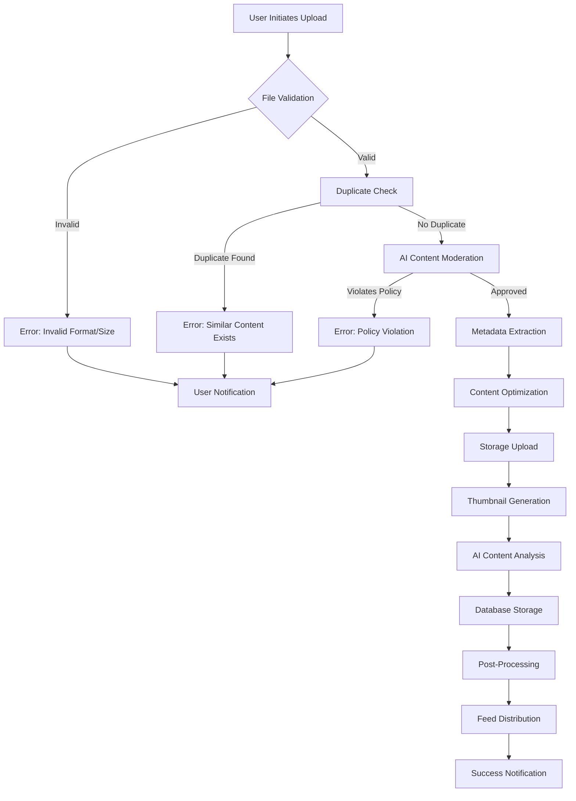
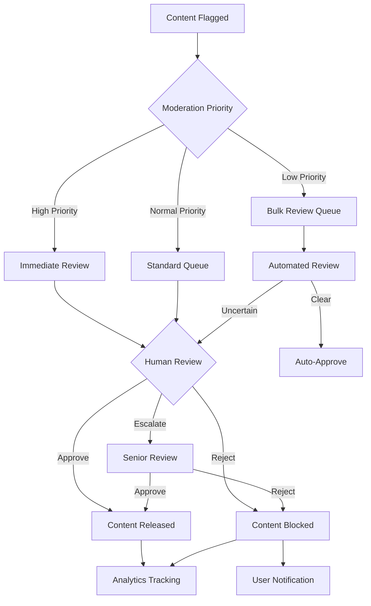
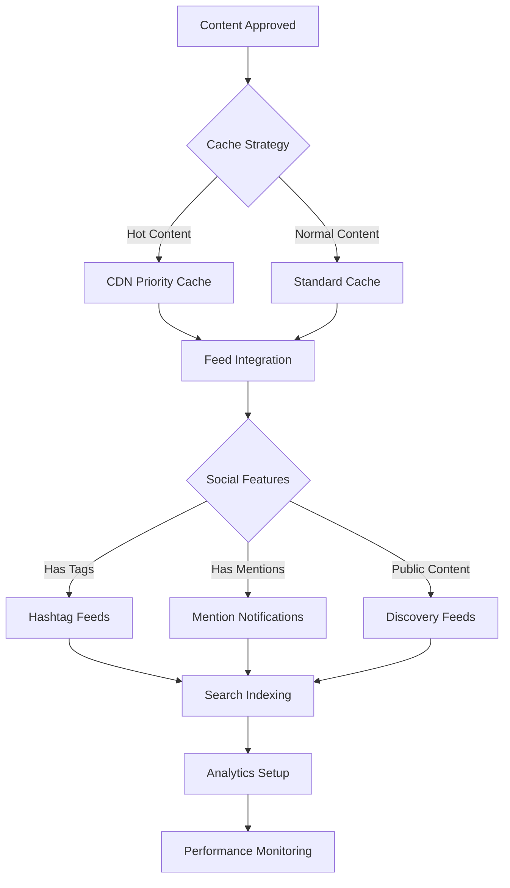
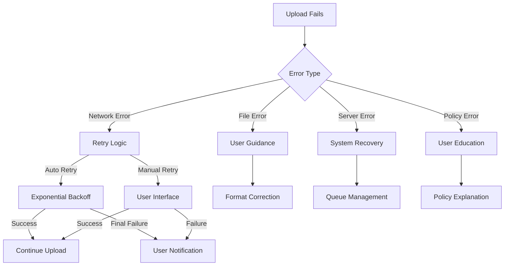
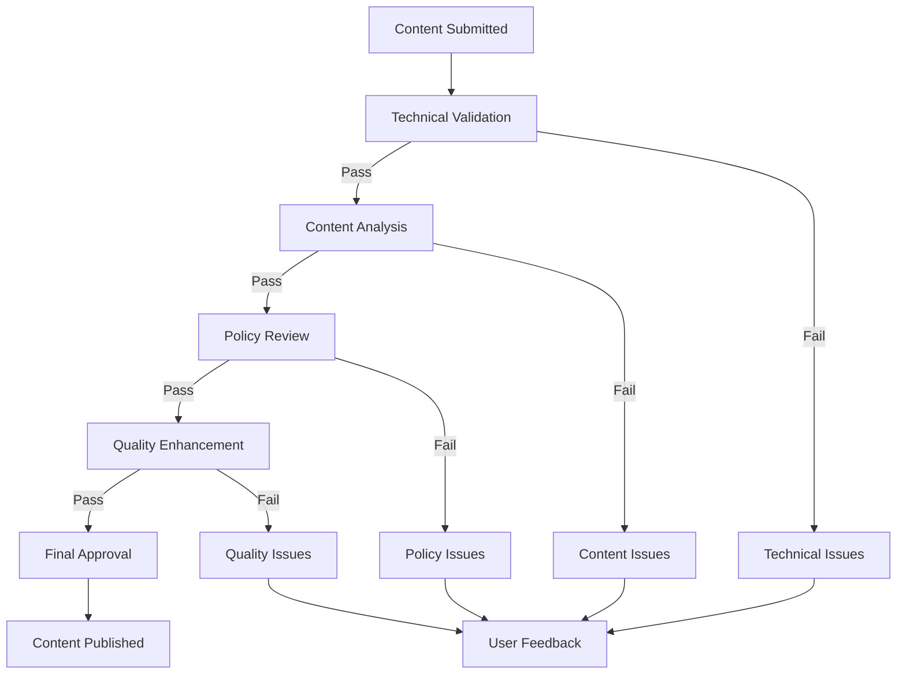

# Content Upload and Moderation Process - Business Logic Flows

## Overview
This document details the comprehensive business logic flows for content upload, processing, and moderation on the PlayNite platform. The workflows ensure content quality, policy compliance, and optimal user experience.

## Content Upload Workflow

### Complete Upload Process Flow Diagram

### Detailed Process Descriptions

#### 1. File Validation Stage
**Business Logic:**
- **Format Validation**: Ensure file types are supported
  - Images: JPEG, PNG, GIF, WebP
  - Videos: MP4, WebM, OGG, AVI, MOV
- **Size Validation**: Enforce platform limits
  - Images: Maximum 10MB
  - Videos: Maximum 100MB
- **Integrity Check**: Verify file is not corrupted

**Error Handling:**
- Clear error messages with specific guidance
- Alternative format suggestions
- Size reduction recommendations

#### 2. Duplicate Detection Stage
**Business Logic:**
- **Similarity Analysis**: AI-powered content comparison
- **Threshold Management**: Configurable similarity percentages
- **Content Hashing**: Efficient duplicate identification
- **False Positive Handling**: Human review for edge cases

**Integration Points:**
- Content Moderation Service
- AI Analysis Engine
- Historical Content Database

#### 3. AI Content Moderation Stage
**Business Logic:**
- **Policy Compliance**: Check against community guidelines
- **Content Classification**: Identify inappropriate material
- **Risk Assessment**: Evaluate content safety levels
- **Automated Decision**: Approve/reject based on confidence scores

**Moderation Criteria:**
- Hate speech and harassment
- Explicit or adult content
- Violence and harmful behavior
- Spam and misleading content
- Copyright infringement

#### 4. Content Processing Pipeline
**Business Logic:**
- **Metadata Extraction**: Dimensions, duration, file properties
- **Quality Optimization**: Compression and format conversion
- **Thumbnail Generation**: Multiple sizes for different contexts
- **AI Enhancement**: Auto-tagging and categorization

**Processing Options:**
- Quality settings (low/medium/high)
- Resolution optimization
- Format standardization
- Metadata enrichment

## Content Moderation Workflow

### Moderation Queue Processing

### Moderation Decision Matrix

| Content Type | Risk Level | Auto-Action | Review Required | Escalation Criteria |
|-------------|------------|-------------|-----------------|-------------------|
| Text Comments | Low | Auto-filter | Random sample | Multiple reports |
| Images | Medium | AI analysis | All content | Policy violations |
| Videos | High | Human review | All content | Complex context |
| Live Content | Critical | Immediate | All content | Real-time issues |

## Post-Upload Processing Workflow

### Content Distribution Pipeline

### Service Integration Points

#### Storage Integration
- **Primary Storage**: Firebase Storage for media files
- **Backup Strategy**: Redundant storage for critical content
- **Access Control**: Public/private content permissions
- **Optimization**: Automatic format conversion and compression

#### Database Integration
- **Content Metadata**: Full content information storage
- **User Associations**: Creator and ownership relationships
- **Analytics Setup**: Performance tracking initialization
- **Search Integration**: Content indexing for discovery

#### Social Integration
- **Activity Creation**: Social feed updates
- **Notification Generation**: User alerts for interactions
- **Engagement Tracking**: Like, comment, share monitoring
- **Recommendation Engine**: Content similarity analysis

## Error Handling and Recovery

### Upload Failure Scenarios

### Recovery Strategies

#### Automatic Recovery
- **Network Issues**: Exponential backoff retry strategy
- **Temporary Failures**: Queue management with persistence
- **Partial Failures**: Resume capability for large files
- **Service Timeouts**: Graceful degradation with user feedback

#### Manual Recovery
- **User Guidance**: Clear error messages with actionable steps
- **Alternative Options**: Suggest workarounds or alternatives
- **Progress Preservation**: Save draft state for resume
- **Support Integration**: Easy access to help resources

## Quality Assurance Gates

### Content Quality Checks

### Quality Gates Definition

#### Technical Quality Gates
- **File Integrity**: Corruption detection and validation
- **Format Compliance**: Supported format and codec verification
- **Size Optimization**: File size appropriateness for content type
- **Metadata Completeness**: Required metadata presence

#### Content Quality Gates
- **Relevance**: Content appropriateness for platform
- **Originality**: Duplicate and spam detection
- **Value**: Content contribution to community
- **Accessibility**: Content usability across devices

#### Policy Quality Gates
- **Community Standards**: Harassment and hate speech detection
- **Legal Compliance**: Copyright and trademark verification
- **Safety Standards**: Age-appropriate content classification
- **Platform Guidelines**: Feature-specific policy adherence

## Performance Optimization Points

### Processing Optimization Strategies

#### Parallel Processing
- **Independent Steps**: Run metadata extraction during upload
- **Batch Operations**: Group similar content for bulk processing
- **Resource Allocation**: Prioritize based on user tier and content type
- **Load Balancing**: Distribute processing across available resources

#### Caching Strategies
- **Content Caching**: Frequently accessed content in fast storage
- **Processing Cache**: Avoid redundant operations on similar content
- **Result Caching**: Store analysis results for reuse
- **Thumbnail Cache**: Pre-generated thumbnails for common sizes

## Analytics and Monitoring

### Performance Tracking Points

#### Upload Analytics
- **Success Rates**: Track completion vs. failure rates
- **Processing Times**: Monitor each stage duration
- **Error Patterns**: Identify common failure scenarios
- **User Behavior**: Understand upload patterns and preferences

#### Quality Metrics
- **Content Ratings**: User-reported content quality scores
- **Engagement Levels**: Track content interaction and sharing
- **Moderation Accuracy**: Measure false positive/negative rates
- **Platform Health**: Overall content ecosystem quality indicators

This comprehensive business logic documentation provides the foundation for system optimization, quality assurance, and continuous improvement of the content upload and moderation processes.