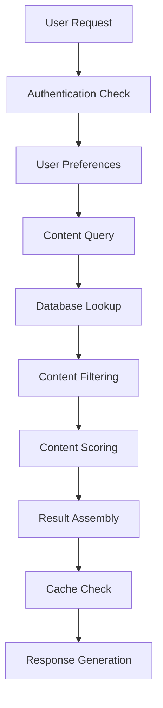

# Content Discovery and Feed Generation Bottlenecks Analysis

## Overview
This document analyzes performance bottlenecks in content discovery, feed generation, and recommendation systems, identifying specific issues and proposing optimization strategies for the PlayNite platform.

## Current Content Discovery Architecture

### Feed Generation Pipeline



### Identified Bottlenecks

#### 1. Database Query Performance
**Current Issues:**
- **Inefficient Queries**: Large table scans for content discovery
- **No Query Optimization**: Lack of proper indexing on frequently queried fields
- **Complex Joins**: Expensive operations across multiple collections
- **No Query Result Caching**: Repeated identical queries

**Performance Impact:**
- Feed loading times: 2-5 seconds (target: <500ms)
- High database load from repeated queries
- Poor scalability as content volume grows

#### 2. Content Scoring Algorithm
**Current Issues:**
- **Synchronous Processing**: Scoring happens during request time
- **No Algorithm Caching**: Recalculation for each request
- **Limited Personalization**: Basic preference-based scoring
- **No Real-time Adaptation**: Static scoring without behavior learning

**Performance Impact:**
- High computational overhead per request
- Inconsistent response times
- Limited personalization effectiveness

#### 3. Feed Assembly and Caching
**Current Issues:**
- **No Feed Precomputation**: Real-time assembly for each request
- **Limited Caching Strategy**: Basic TTL-based caching
- **No Personalized Caching**: Same cache for all users
- **Cache Invalidation Issues**: Over-invalidation causing cache misses

**Performance Impact:**
- High server load for popular content
- Inconsistent user experience
- Poor scalability during peak usage

## Specific Bottleneck Analysis

### Database Query Bottlenecks

#### Inefficient Content Retrieval
**Current Query Pattern:**
```javascript
// Example of current inefficient query
const feed = await getDocs(query(
  collection(db, 'content'),
  where('isPublic', '==', true),
  where('category', '==', userPreferences.category),
  orderBy('createdAt', 'desc'),
  limit(20)
));
```

**Issues Identified:**
1. **No Composite Indexing**: Queries on multiple fields without proper indexing
2. **Large Result Sets**: Fetching more data than needed for initial display
3. **No Query Result Pagination**: Inefficient offset-based pagination
4. **Repeated Queries**: Identical queries for similar user preferences

#### Social Graph Queries
**Current Issues:**
- **Follower Graph Traversal**: Expensive recursive queries for social feeds
- **No Graph Caching**: Rebuilding social graphs for each request
- **Inefficient Friendship Queries**: Multiple queries for friend relationships
- **No Social Proximity Calculation**: Limited social relevance scoring

### Algorithm Performance Bottlenecks

#### Content Scoring Complexity
**Current State:**
- **Multiple Scoring Factors**: Engagement, recency, relevance, social proximity
- **Synchronous Calculation**: All scoring happens during request
- **No Incremental Updates**: Full recalculation for each content item
- **Limited ML Integration**: Basic rule-based scoring

**Performance Issues:**
- **High CPU Usage**: Complex calculations for each feed request
- **Inconsistent Latency**: Variable response times based on content volume
- **Scalability Limits**: Performance degrades linearly with content growth

#### Recommendation Engine Bottlenecks
**Current Issues:**
- **Cold Start Problem**: No recommendations for new users
- **Limited Contextual Data**: Basic preference-based recommendations
- **No Real-time Learning**: Static recommendation models
- **Sparsity Issues**: Poor recommendations for niche interests

### Caching and Delivery Bottlenecks

#### Cache Strategy Issues
**Current State:**
- **Basic TTL Caching**: Simple time-based expiration
- **No Smart Invalidation**: Over-invalidation on content updates
- **Limited Cache Granularity**: Same cache for all users
- **No Predictive Caching**: Reactive caching only

**Performance Impact:**
- **Low Cache Hit Rates**: Frequent cache misses causing slow responses
- **Stale Content**: Over-caching leading to outdated feeds
- **Poor Personalization**: Generic caching misses user-specific optimizations

## Feed Generation Performance Issues

### Infinite Scroll Implementation
**Current Issues:**
- **No Virtual Scrolling**: Loading all content into DOM
- **Large Payloads**: Sending unnecessary data to clients
- **No Progressive Loading**: All-or-nothing content delivery
- **Memory Issues**: Accumulating content in browser memory

### Real-time Update Bottlenecks
**Current Issues:**
- **Polling-based Updates**: Inefficient real-time data fetching
- **No Delta Updates**: Sending complete feed on each update
- **WebSocket Overhead**: Excessive connection management
- **No Update Batching**: Individual updates for each content change

## Optimization Opportunities

### Database Query Optimization

#### Query Performance Improvements
1. **Composite Indexing Strategy**
   - Create indexes on frequently queried field combinations
   - Implement partial indexes for common filter patterns
   - Use covering indexes to avoid table access

2. **Query Result Caching**
   - Implement Redis-based query result caching
   - Cache popular content queries with smart invalidation
   - Use query result pagination for large datasets

3. **Social Graph Optimization**
   - Precompute follower/following relationships
   - Cache social proximity scores
   - Implement graph database for complex social queries

#### Advanced Query Patterns
```javascript
// Optimized query with proper indexing
const feed = await getDocs(query(
  collection(db, 'content'),
  where('isPublic', '==', true),
  where('category', 'in', userPreferences.categories),
  orderBy('score', 'desc'), // Pre-computed relevance score
  limit(20)
));
```

### Algorithm Optimization

#### Scoring Engine Improvements
1. **Asynchronous Scoring**
   - Move scoring to background processes
   - Use pre-computed scores for feed generation
   - Implement incremental score updates

2. **Machine Learning Integration**
   - Implement collaborative filtering for better recommendations
   - Use real-time learning from user behavior
   - Personalize scoring based on individual patterns

3. **Caching Strategy**
   - Cache scoring results for popular content
   - Use intelligent cache invalidation based on content age
   - Implement score precomputation for active users

### Feed Assembly Optimization

#### Smart Feed Precomputation
1. **Personalized Feed Caching**
   - Precompute feeds for active users
   - Use user behavior patterns for cache refresh timing
   - Implement delta updates for feed changes

2. **Progressive Content Loading**
   - Load above-the-fold content first
   - Use virtual scrolling for large feeds
   - Implement lazy loading for media content

3. **Real-time Update Optimization**
   - Use WebSocket for true real-time updates
   - Implement delta updates for feed changes
   - Batch multiple updates for efficiency

## Content Discovery Enhancement

### Search Performance Bottlenecks

#### Current Search Issues
- **No Full-text Search**: Limited text search capabilities
- **No Fuzzy Matching**: Exact match requirements
- **Limited Filtering**: Basic category and tag filtering
- **No Search Analytics**: No optimization based on search patterns

#### Search Optimization Opportunities
1. **Elasticsearch Integration**: Fast, scalable full-text search
2. **Smart Filtering**: AI-powered content categorization
3. **Search Result Caching**: Cache popular search queries
4. **Personalized Search**: Search results based on user preferences

### Recommendation Engine Bottlenecks

#### Current Recommendation Issues
- **Limited Data Sources**: Basic engagement-based recommendations
- **No Contextual Recommendations**: Missing time, location, device context
- **Cold Start Problems**: Poor recommendations for new users
- **No Cross-platform Learning**: Limited learning from external signals

#### Recommendation Optimization
1. **Multi-armed Bandit Algorithms**: Learn optimal content mix
2. **Deep Learning Models**: Neural collaborative filtering
3. **Contextual Recommendations**: Time, location, device-aware suggestions
4. **Cross-platform Integration**: Learn from external social signals

## Performance Monitoring and Measurement

### Key Performance Indicators

#### Feed Performance Metrics
- **Time to First Content**: Speed of initial feed load
- **Feed Loading Time**: Complete feed assembly time
- **Cache Hit Rate**: Effectiveness of caching strategies
- **User Engagement**: Time spent, interaction rates

#### Discovery Quality Metrics
- **Content Relevance Score**: How well feed matches user interests
- **Discovery Diversity**: Variety in recommended content
- **Serendipity Rate**: Unexpected but engaging content discovery
- **Search Success Rate**: Users finding desired content

### Bottleneck Detection Framework

#### Real-time Performance Monitoring
1. **Query Performance Tracking**: Monitor slow queries in real-time
2. **Cache Performance Metrics**: Hit rates, miss patterns, invalidation efficiency
3. **Algorithm Performance**: Scoring time, recommendation accuracy
4. **User Experience Metrics**: Loading times, interaction responsiveness

#### Automated Bottleneck Detection
1. **Anomaly Detection**: Identify unusual performance patterns
2. **Correlation Analysis**: Find relationships between metrics
3. **Trend Analysis**: Predict performance issues before they occur
4. **Automated Alerts**: Proactive notification of performance degradation

## Implementation Strategy

### Phase 1: Quick Wins (Weeks 1-4)
1. **Query Optimization**: Add missing database indexes
2. **Basic Caching**: Implement Redis caching for popular queries
3. **Progress Tracking**: Better user feedback during loading
4. **Error Monitoring**: Track and analyze performance issues

### Phase 2: Core Improvements (Weeks 5-12)
1. **Advanced Caching Strategy**: Personalized feed caching
2. **Algorithm Optimization**: Asynchronous scoring and recommendations
3. **Database Query Enhancement**: Query result caching and optimization
4. **Real-time Monitoring**: Comprehensive performance tracking

### Phase 3: Advanced Features (Months 3-6)
1. **Machine Learning Integration**: Advanced recommendation algorithms
2. **Predictive Optimization**: AI-powered performance optimization
3. **Global Performance**: Multi-region content distribution
4. **Advanced Analytics**: Deep insights into user behavior and preferences

## Success Measurement

### Performance Improvement Targets
- **Feed Loading Time**: Reduce from 2-5 seconds to <500ms (75% improvement)
- **Database Query Time**: Reduce from 200-800ms to <100ms (70% improvement)
- **Cache Hit Rate**: Increase from <30% to >80% (60% improvement)
- **Recommendation Relevance**: Improve by 40% based on engagement metrics

### User Experience Improvements
- **Perceived Performance**: Faster, more responsive content discovery
- **Content Quality**: More relevant and engaging feed content
- **Discovery Serendipity**: Better balance of familiar and novel content
- **Personalization**: More accurate content recommendations

This comprehensive bottleneck analysis provides a roadmap for transforming content discovery from a performance bottleneck into a competitive advantage, enabling scalable, personalized, and engaging user experiences.