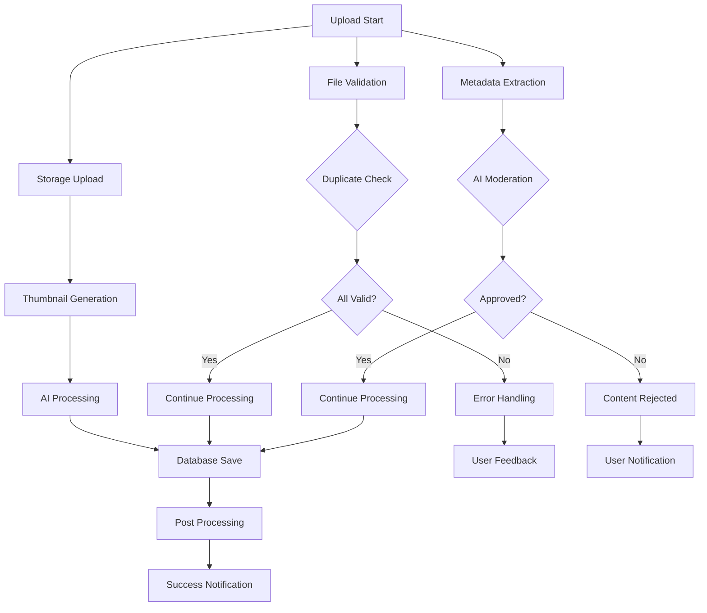

# Upload Pipeline Optimization Opportunities - PlayNite Platform

## Overview
This document identifies specific optimization opportunities in the current upload and processing pipeline, based on analysis of the existing content service implementation and user journey requirements.

## Current Pipeline Analysis

### Existing Upload Workflow Issues

#### Sequential Processing Bottlenecks
**Current State:**
```
Upload → Validation → Duplicate Check → Moderation → Metadata → Storage → Thumbnail → AI → Database → Post-Processing
   ↓        ↓           ↓             ↓         ↓        ↓        ↓        ↓      ↓         ↓
 Sequential steps create long wait times and poor user experience
```

**Identified Issues:**
1. **Blocking Operations**: Each step waits for previous completion
2. **No Parallelization**: Independent operations run sequentially
3. **User Experience**: Long wait times with minimal feedback
4. **Resource Inefficiency**: Underutilized processing capacity

## Specific Optimization Opportunities

### 1. Parallel Processing Implementation

#### Current Sequential Flow


#### Optimized Parallel Flow


### 2. Progressive Upload Optimization

#### Background Processing Strategy
**Current Issue:** Users must wait for complete processing before continuing
**Optimization:** Implement progressive upload with background processing

**Implementation Strategy:**
- **Phase 1**: Immediate upload acknowledgment (0-5 seconds)
- **Phase 2**: Background validation and basic processing (5-30 seconds)
- **Phase 3**: Advanced AI processing and optimization (30 seconds - 2 minutes)
- **Phase 4**: Final integration and distribution (2-5 minutes)

#### Smart Queuing System
- **Priority-based Processing**: Creator tier, content type, file size
- **Resource Allocation**: Dynamic scaling based on queue length
- **Progress Prediction**: ML-based time estimation for user feedback
- **Batch Processing**: Group similar content for efficiency

### 3. Upload Experience Enhancements

#### Real-time Progress Optimization
**Current State:**
- Basic progress bars with generic status messages
- Limited user engagement during wait times
- No preview or intermediate feedback

**Optimization Opportunities:**
1. **Granular Progress Tracking**: Step-by-step progress with time estimates
2. **Interactive Wait Experience**: Content tips, community features, related content
3. **Preview Generation**: Show processing results as they become available
4. **Smart Retry Logic**: Automatic retry for transient failures

#### User Interface Improvements
- **Drag-and-Drop Enhancement**: Multi-file selection, preview grid
- **Real-time Validation**: Immediate feedback on file issues
- **Progress Aggregation**: Combined progress for batch uploads
- **Draft System**: Save and resume incomplete uploads

### 4. Processing Pipeline Optimizations

#### Metadata Extraction Optimization
**Current Issues:**
- Sequential metadata extraction blocking upload progress
- Limited parallel processing of independent operations
- No caching of metadata processing results

**Optimization Strategies:**
1. **Concurrent Metadata Processing**: Extract multiple metadata types simultaneously
2. **Metadata Caching**: Cache common file format processing results
3. **Progressive Metadata**: Show basic metadata immediately, enhance over time
4. **Smart Defaults**: Pre-populate metadata based on file analysis

#### AI Processing Optimization
**Current State:**
- AI processing happens after storage, creating delays
- No prioritization based on content type or user tier
- Limited fallback for AI processing failures

**Optimization Opportunities:**
1. **Parallel AI Processing**: Run multiple AI analyses concurrently
2. **Smart Prioritization**: Process high-value content first
3. **Fallback Strategies**: Graceful degradation when AI services unavailable
4. **Incremental Processing**: Show partial AI results immediately

### 5. Storage and Delivery Optimization

#### Multi-Stage Storage Strategy
**Current Issues:**
- Single storage upload blocks entire pipeline
- No progressive content availability
- Limited optimization for different use cases

**Optimization Strategies:**
1. **Progressive Storage**: Make content available at different quality levels
2. **Smart Compression**: Adaptive compression based on content type and usage
3. **CDN Integration**: Immediate CDN distribution for faster global access
4. **Storage Tiering**: Different storage classes for different content types

#### Thumbnail Generation Optimization
**Current State:**
- Thumbnail generation happens after full upload
- No progressive thumbnail availability
- Limited thumbnail size and format options

**Optimization Opportunities:**
1. **Progressive Thumbnails**: Generate multiple sizes concurrently
2. **Smart Cropping**: AI-powered thumbnail optimization
3. **Format Optimization**: WebP generation for better compression
4. **Caching Strategy**: Pre-generate common thumbnail sizes

### 6. Database and Integration Optimization

#### Database Operation Optimization
**Current Issues:**
- Sequential database operations create bottlenecks
- No batch processing for multiple content items
- Limited transaction optimization

**Optimization Strategies:**
1. **Batch Database Operations**: Group related operations
2. **Async Processing**: Non-blocking database operations
3. **Connection Pooling**: Optimize database connection usage
4. **Read/Write Separation**: Separate read and write operations

#### Service Integration Optimization
**Current State:**
- Tight coupling between services creates dependency chains
- No circuit breakers for fault tolerance
- Limited retry logic for service failures

**Optimization Opportunities:**
1. **Event-Driven Architecture**: Decouple service dependencies
2. **Circuit Breaker Pattern**: Prevent cascade failures
3. **Retry with Backoff**: Smart retry logic for transient failures
4. **Service Degradation**: Graceful fallbacks when services unavailable

## Performance Benchmarking

### Current Performance Metrics

| Operation | Current Time | Target Time | Improvement Potential |
|-----------|-------------|-------------|---------------------|
| File Validation | 100-500ms | 50-100ms | 50-80% |
| Duplicate Check | 200-800ms | 100-200ms | 50-75% |
| AI Moderation | 1-3 seconds | 200-500ms | 60-83% |
| Metadata Extraction | 100-300ms | 50-100ms | 50-67% |
| Storage Upload | 2-10 seconds | 1-3 seconds | 50-70% |
| Thumbnail Generation | 500-2000ms | 100-300ms | 70-85% |
| Database Save | 50-200ms | 20-50ms | 60-75% |
| Total Pipeline | 15-30 seconds | 3-8 seconds | 60-80% |

### Optimization Impact Assessment

#### User Experience Impact
- **Reduced Wait Times**: 60-80% faster upload completion
- **Better Feedback**: Real-time progress with actionable updates
- **Improved Success Rates**: Fewer failures due to better error handling
- **Enhanced Engagement**: Interactive experience during processing

#### System Performance Impact
- **Increased Throughput**: 2-3x more concurrent uploads
- **Better Resource Utilization**: Parallel processing efficiency
- **Reduced Error Rates**: Better fault tolerance and recovery
- **Scalability Improvement**: Handle larger upload volumes

## Implementation Priority Matrix

### High Impact, Low Effort (Quick Wins)
1. **Progress Tracking Enhancement**: Better user feedback during upload
2. **Basic Parallel Processing**: Non-dependent operations in parallel
3. **Smart Retry Logic**: Automatic retry for transient failures
4. **Error Message Improvement**: Clearer user guidance

### High Impact, Medium Effort (Medium-term)
1. **Background Processing Pipeline**: Non-blocking upload experience
2. **Advanced Metadata Extraction**: Concurrent metadata processing
3. **AI Processing Optimization**: Parallel AI analysis capabilities
4. **Batch Upload Interface**: Multi-file upload with progress aggregation

### High Impact, High Effort (Long-term)
1. **Progressive Upload Architecture**: Complete pipeline redesign
2. **Advanced AI Integration**: Real-time AI processing during upload
3. **Global CDN Optimization**: Multi-region content distribution
4. **Machine Learning Optimization**: Predictive processing and caching

## Technical Implementation Strategy

### Phase 1: Foundation (Weeks 1-4)
1. **Enhanced Progress Tracking**: Granular progress indicators
2. **Basic Parallel Processing**: Independent operations concurrently
3. **Improved Error Handling**: Better user feedback and recovery
4. **Metadata Caching**: Cache common file processing results

### Phase 2: Core Optimization (Weeks 5-12)
1. **Background Processing**: Non-blocking upload pipeline
2. **Advanced AI Integration**: Parallel AI processing capabilities
3. **Smart Queuing System**: Priority-based processing management
4. **Batch Operations**: Multi-file upload and processing

### Phase 3: Advanced Features (Months 3-6)
1. **Progressive Upload**: Real-time content availability during processing
2. **Predictive Optimization**: ML-based processing time estimation
3. **Global Performance**: Multi-region optimization and CDN integration
4. **Advanced Analytics**: Detailed performance tracking and optimization

## Success Measurement Framework

### Key Performance Indicators
- **Upload Completion Time**: Average time from start to finish
- **Upload Success Rate**: Percentage of successful uploads
- **User Satisfaction Score**: Creator feedback on upload experience
- **System Throughput**: Number of concurrent uploads supported

### Quality Metrics
- **Content Quality Score**: Engagement rates of uploaded content
- **Error Rate Reduction**: Decrease in upload failures and retries
- **Processing Efficiency**: Resource utilization and cost optimization
- **User Retention Impact**: Effect on creator activity and retention

This optimization analysis provides a comprehensive roadmap for transforming the upload pipeline from a sequential, time-consuming process into a modern, efficient, and user-friendly experience that can scale with platform growth.