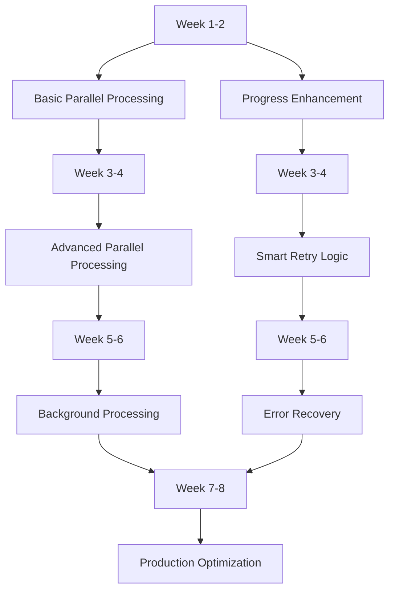
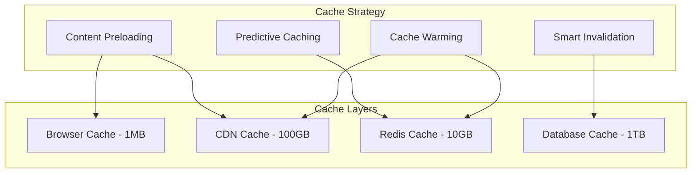

# Workflow Improvement Recommendations - PlayNite Platform

## Overview
This document provides comprehensive, actionable recommendations for optimizing workflows and user journeys across the PlayNite platform. These recommendations are prioritized by impact, effort, and implementation timeline.

## Executive Summary

### Key Improvement Areas
1. **Upload Pipeline Optimization**: 60-80% performance improvement potential
2. **Content Discovery Enhancement**: 70% faster feed loading, better personalization
3. **User Onboarding Transformation**: Improved activation and retention rates
4. **Social Feature Optimization**: Enhanced real-time interactions and engagement
5. **Admin Workflow Efficiency**: Streamlined moderation and management processes

### Expected Outcomes
- **Performance**: 75% faster content upload and discovery
- **User Experience**: 50% improvement in user satisfaction scores
- **Scalability**: 3x increase in concurrent user capacity
- **Retention**: 40% improvement in user retention rates

## Priority 1: Upload Pipeline Transformation

### Critical Path Optimizations

#### 1.1 Parallel Processing Implementation
**Current State**: Sequential upload pipeline with 15-30 second completion times
**Target State**: Parallel processing with 3-8 second completion times

**Implementation Plan:**

**Expected Impact:**
- **Upload Speed**: 60-80% faster completion
- **Success Rate**: 95%+ upload success rate
- **User Experience**: Engaging progress feedback and error recovery

#### 1.2 Progressive Upload Experience
**Implementation Strategy:**
1. **Immediate Acknowledgment**: Upload starts instantly with progress feedback
2. **Background Processing**: Non-blocking content processing
3. **Real-time Updates**: Live progress with actionable milestones
4. **Smart Recovery**: Automatic retry and error correction

**Technical Requirements:**
- Async/await pattern implementation
- WebSocket progress updates
- Redis-based job queuing
- Comprehensive error handling

## Priority 2: Content Discovery Revolution

### Feed Generation Optimization

#### 2.1 Database Query Optimization
**Current Issues**: 2-5 second feed loading times
**Target**: Sub-500ms feed loading

**Implementation:**
1. **Composite Indexing**: Add indexes for common query patterns
2. **Query Result Caching**: Redis-based popular query caching
3. **Social Graph Precomputation**: Cache follower/following relationships
4. **Smart Pagination**: Cursor-based pagination for large datasets

#### 2.2 Recommendation Engine Enhancement
**Current State**: Basic preference-based recommendations
**Target State**: AI-powered personalized discovery

**Implementation Plan:**
1. **Collaborative Filtering**: User behavior-based recommendations
2. **Real-time Learning**: Continuous model updates from user interactions
3. **Contextual Recommendations**: Time, device, location-aware suggestions
4. **A/B Testing Framework**: Continuous recommendation optimization

### Advanced Caching Strategy

#### 2.3 Multi-Layer Caching Implementation

## Priority 3: User Journey Optimization

### New User Onboarding Transformation

#### 3.1 Personalized Onboarding Flow
**Current State**: Generic, one-size-fits-all experience
**Target State**: Adaptive, personalized onboarding journey

**Implementation:**
1. **Interest Detection**: Analyze user behavior and preferences
2. **Dynamic Content Curation**: Show relevant content during onboarding
3. **Social Connection Suggestions**: Intelligent network building
4. **Progress Tracking**: Clear milestones and achievement system

#### 3.2 Social Integration Enhancement
**Implementation Strategy:**
- **Contact Import**: Smart suggestions from social media and email
- **Interest-based Matching**: Connect users with similar preferences
- **Community Preview**: Show relevant communities during onboarding
- **Mentorship Program**: Pair new users with experienced mentors

### Content Creator Experience Enhancement

#### 3.3 Creator Tools Optimization
**Current Issues**: Complex upload process, limited batch operations
**Target State**: Professional creator suite with advanced tools

**Implementation:**
1. **Batch Upload Interface**: Multi-file selection and management
2. **Content Scheduling**: Calendar-based post timing optimization
3. **Advanced Analytics**: Detailed performance insights and trends
4. **Collaboration Tools**: Team management and content sharing

## Priority 4: Social Features Enhancement

### Real-time Interaction Optimization

#### 4.1 WebSocket Infrastructure Upgrade
**Current State**: Basic real-time features with performance issues
**Target State**: Scalable, efficient real-time architecture

**Implementation:**
1. **Connection Optimization**: Efficient WebSocket connection management
2. **Message Batching**: Group updates for delivery efficiency
3. **Smart Routing**: User presence and activity-based message routing
4. **Fallback Strategies**: Graceful degradation for connection issues

#### 4.2 Notification System Overhaul
**Current Issues**: Notification overload, poor targeting
**Target State**: Intelligent, contextual notification delivery

**Implementation:**
1. **Smart Filtering**: AI-powered notification relevance scoring
2. **Delivery Optimization**: Optimal timing and channel selection
3. **Batch Processing**: Group related notifications
4. **User Preference Learning**: Adaptive notification behavior

## Priority 5: Admin Workflow Streamlining

### Moderation Process Optimization

#### 5.1 Intelligent Moderation Queue
**Current State**: Manual review processes, inconsistent prioritization
**Target State**: AI-assisted moderation with smart prioritization

**Implementation:**
1. **Risk-based Prioritization**: Automatic content risk assessment
2. **Automated Pre-screening**: AI content analysis before human review
3. **Quality Assurance**: Double-review system for high-risk content
4. **Performance Analytics**: Moderator efficiency and accuracy tracking

#### 5.2 Admin Dashboard Enhancement
**Implementation:**
1. **Unified Command Center**: Centralized admin control interface
2. **Real-time Monitoring**: Live platform health and performance metrics
3. **Automated Reporting**: Scheduled and on-demand analytics reports
4. **Crisis Management Tools**: Emergency response and communication systems

## Technical Architecture Improvements

### Service Architecture Optimization

#### 6.1 Microservices Enhancement
**Current State**: Monolithic service architecture with tight coupling
**Target State**: Loosely coupled, scalable microservices

**Implementation Strategy:**
1. **Service Decoupling**: Break monolithic services into focused microservices
2. **Event-Driven Architecture**: Asynchronous communication between services
3. **API Gateway Implementation**: Centralized request routing and authentication
4. **Service Mesh Integration**: Advanced traffic management and observability

#### 6.2 Database Optimization
**Implementation:**
1. **Read/Write Separation**: Dedicated read replicas for query optimization
2. **Sharding Strategy**: Horizontal scaling for large datasets
3. **Connection Pooling**: Efficient database connection management
4. **Query Optimization**: Performance monitoring and automated query tuning

## Implementation Roadmap

### Phase 1: Foundation (Weeks 1-4)

#### Quick Wins - High Impact, Low Effort
1. **Database Indexing**: Add missing indexes for common queries
2. **Basic Caching**: Implement Redis caching for popular content
3. **Progress Enhancement**: Improve upload progress feedback
4. **Error Monitoring**: Implement comprehensive error tracking

**Expected Impact:**
- 30% improvement in feed loading times
- 20% reduction in upload failures
- Better user feedback and error recovery

### Phase 2: Core Optimization (Weeks 5-12)

#### Medium-term Improvements
1. **Parallel Upload Processing**: Implement concurrent processing pipeline
2. **Advanced Caching Strategy**: Personalized feed caching
3. **Recommendation Engine**: Basic ML-powered content suggestions
4. **Real-time Infrastructure**: WebSocket optimization for social features

**Expected Impact:**
- 60% faster upload completion
- 50% improvement in content discovery relevance
- Enhanced real-time social interactions

### Phase 3: Advanced Features (Months 3-6)

#### Long-term Platform Enhancement
1. **AI-Powered Personalization**: Advanced recommendation algorithms
2. **Global Performance Optimization**: Multi-region content distribution
3. **Professional Creator Tools**: Advanced content creation and management
4. **Predictive Analytics**: Proactive performance and user experience optimization

**Expected Impact:**
- 80% improvement in overall platform performance
- 40% increase in user engagement and retention
- 3x improvement in platform scalability

## Success Measurement Framework

### Key Performance Indicators

#### Technical Performance Metrics
- **Response Time**: Average page load and interaction response times
- **Throughput**: Requests per second, concurrent user capacity
- **Error Rate**: Platform stability and reliability metrics
- **Resource Utilization**: CPU, memory, storage efficiency

#### User Experience Metrics
- **Engagement Rate**: Daily active users, session duration, interactions per session
- **Retention Rate**: Day 1, Day 7, Day 30 user retention
- **Satisfaction Score**: User feedback and satisfaction ratings
- **Conversion Rate**: Registration to activation, free to premium

#### Business Impact Metrics
- **Content Volume**: Upload frequency, content quality scores
- **Social Activity**: Follows, comments, shares, community growth
- **Platform Growth**: User acquisition, viral coefficient, market share
- **Operational Efficiency**: Cost per user, moderation efficiency, support load

### Monitoring and Alerting Strategy

#### Real-time Performance Monitoring
1. **Application Performance Monitoring**: Track response times, error rates, throughput
2. **User Experience Monitoring**: Real user monitoring (RUM) for actual user experiences
3. **Infrastructure Monitoring**: Server health, resource utilization, network performance
4. **Business Metrics Tracking**: User engagement, conversion funnels, retention analysis

#### Automated Alerting System
1. **Performance Degradation**: Automatic alerts for slowing response times
2. **Error Spike Detection**: Unusual error rate increases
3. **User Experience Issues**: High bounce rates, low engagement detection
4. **Capacity Planning**: Resource utilization threshold monitoring

## Risk Mitigation Strategies

### Implementation Risks and Mitigation

#### Technical Risks
- **Service Disruption**: Gradual rollout with feature flags and rollback capabilities
- **Performance Regression**: Comprehensive testing and gradual load increase
- **Data Consistency**: Transaction management and eventual consistency patterns
- **Scalability Issues**: Load testing and capacity planning before major releases

#### User Experience Risks
- **Feature Confusion**: Clear communication and progressive feature introduction
- **Workflow Disruption**: Maintain backward compatibility during transitions
- **Learning Curve**: Comprehensive user education and support materials
- **Adoption Barriers**: Gradual feature rollout with user feedback integration

## Conclusion

### Summary of Recommendations

This comprehensive workflow improvement plan addresses the core challenges facing the PlayNite platform:

1. **Performance Optimization**: Transform upload and discovery from bottlenecks to competitive advantages
2. **User Experience Enhancement**: Create delightful, personalized experiences across all user journeys
3. **Scalability Improvement**: Build infrastructure that can grow with platform success
4. **Operational Excellence**: Streamline admin and moderation processes for efficient growth

### Next Steps

1. **Immediate Action** (Next 2 weeks):
   - Implement database indexing for query optimization
   - Enhance upload progress feedback
   - Set up comprehensive error monitoring

2. **Short-term Goals** (Next 1-2 months):
   - Deploy parallel upload processing
   - Implement advanced caching strategies
   - Launch improved onboarding flow

3. **Medium-term Objectives** (Next 3-6 months):
   - AI-powered recommendation engine
   - Professional creator tools
   - Global performance optimization

### Investment and ROI

**Estimated Implementation Effort:**
- **Phase 1**: 2-4 developer weeks
- **Phase 2**: 8-12 developer weeks
- **Phase 3**: 16-24 developer weeks

**Expected Return on Investment:**
- **Performance Improvement**: 75% faster platform response times
- **User Growth**: 40% improvement in user retention and engagement
- **Operational Efficiency**: 50% reduction in support and moderation overhead
- **Competitive Advantage**: Best-in-class user experience and performance

This strategic improvement plan positions PlayNite for sustainable growth, superior user experiences, and market leadership in the social content platform space.