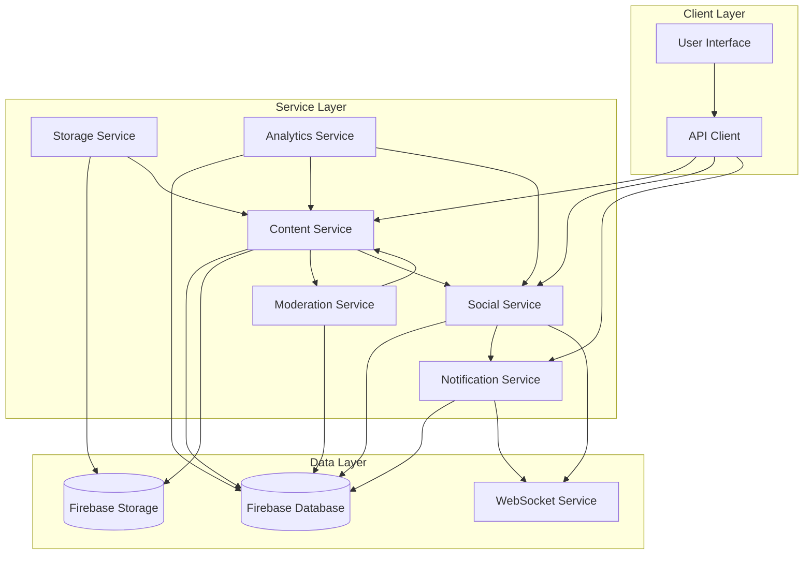
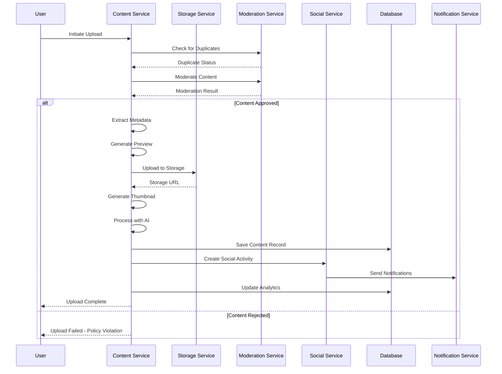
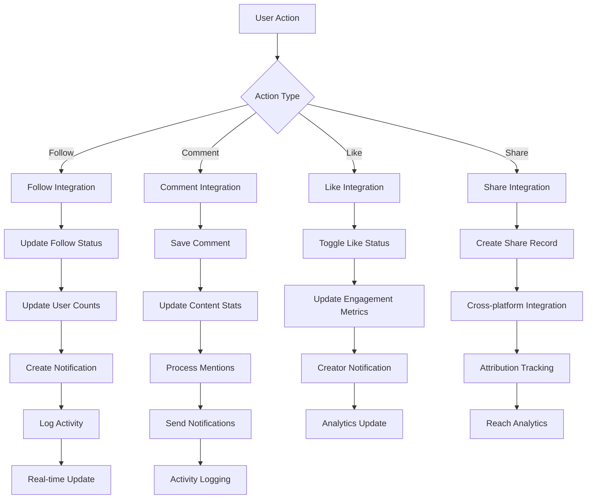
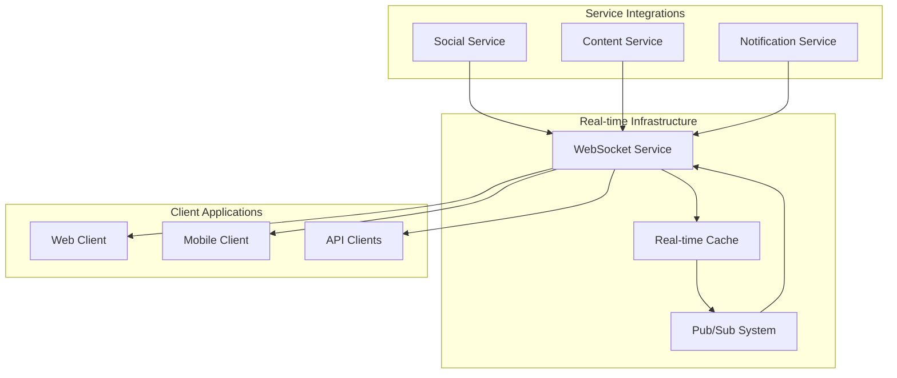
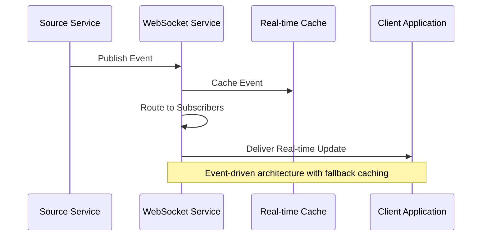
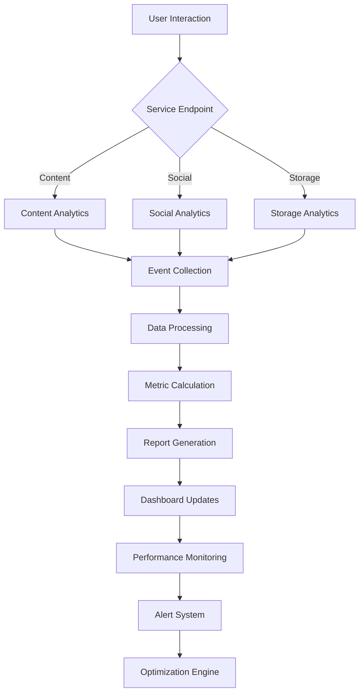
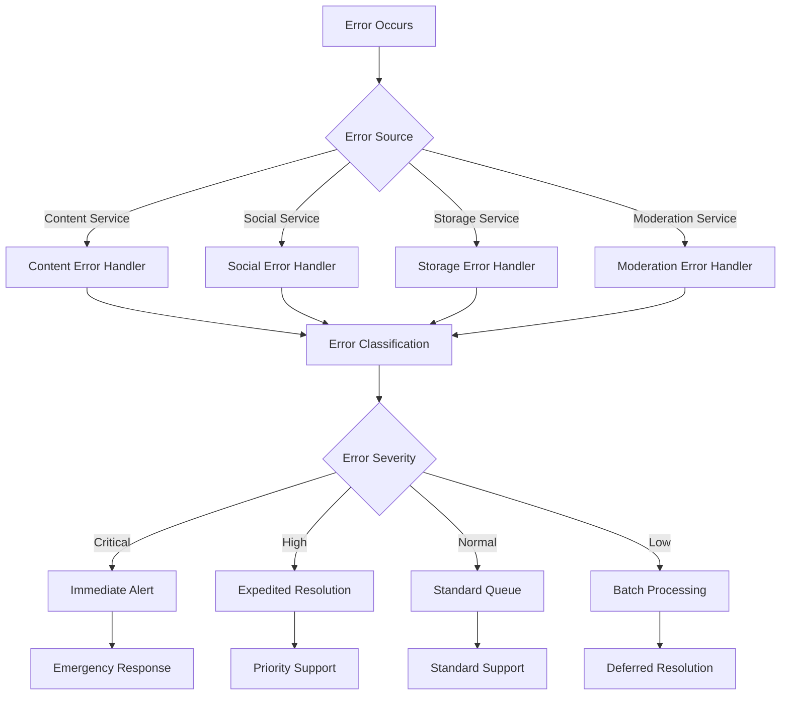
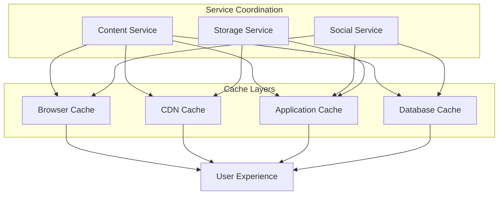
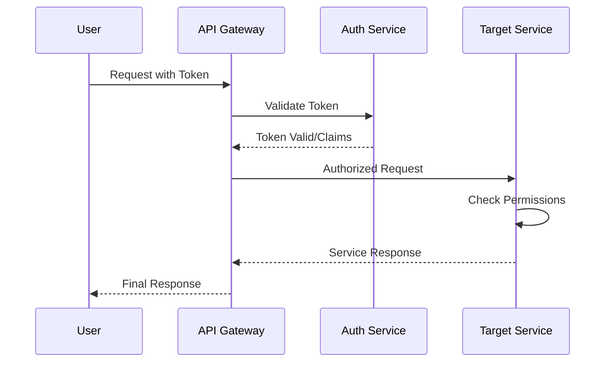
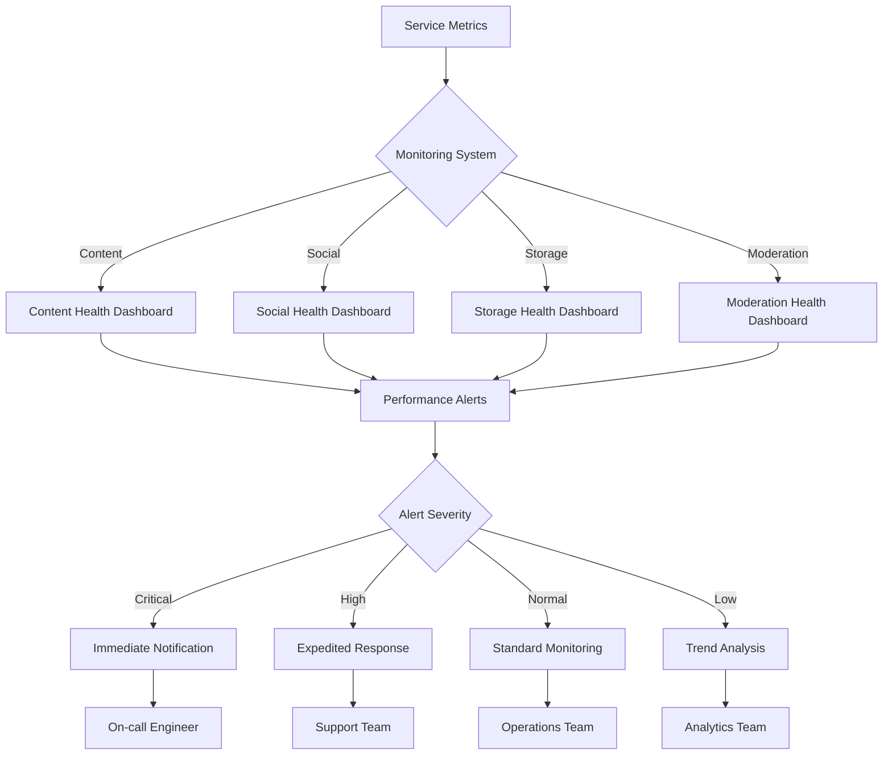

# Service Integration Flows - PlayNite Platform

## Overview
This document details how different services integrate and communicate to provide seamless functionality across the PlayNite platform. Understanding these integration points is crucial for optimization, debugging, and scaling decisions.

## Core Service Architecture

### Service Interaction Overview

## Content Upload Integration Flow

### Complete Upload Pipeline Integration

### Service Integration Points

#### Content ↔ Storage Integration
- **File Upload**: Content service delegates storage operations
- **URL Generation**: Storage service provides public URLs
- **Metadata Sync**: File properties synchronized between services
- **Deletion Management**: Coordinated cleanup across services

#### Content ↔ Moderation Integration
- **Pre-upload Checks**: Duplicate detection before processing
- **AI Moderation**: Automated content policy compliance
- **Human Review**: Escalation path for uncertain content
- **Feedback Loop**: Moderation results improve future processing

## Social Features Integration Flow

### Social Interaction Pipeline

### Cross-Service Dependencies

#### Social ↔ Content Integration
- **Content Creation**: Triggers social activity generation
- **Content Engagement**: Updates social interaction metrics
- **Content Discovery**: Uses social graph for personalization
- **Content Moderation**: Integrates social reporting systems

#### Social ↔ Notification Integration
- **Real-time Delivery**: Instant notifications for social actions
- **Preference Management**: User notification settings synchronization
- **Batch Processing**: Efficient notification grouping across services
- **Channel Coordination**: Multi-channel delivery optimization

## Real-time Features Integration

### WebSocket Integration Architecture

### Real-time Event Flow

## Analytics Integration Flows

### Cross-Service Analytics Pipeline

### Analytics Data Flow

#### Event Collection Integration
- **Content Events**: Upload, view, engagement, performance
- **Social Events**: Follows, comments, likes, shares, notifications
- **Storage Events**: Upload progress, file access, performance metrics
- **System Events**: Errors, performance, security incidents

#### Data Processing Pipeline
- **Real-time Processing**: Immediate metric updates for live features
- **Batch Processing**: Aggregated analytics for reports and insights
- **Machine Learning**: Predictive analytics and recommendation engines
- **Export Integration**: Third-party analytics platform synchronization

## Error Handling Integration

### Cross-Service Error Management

### Error Recovery Integration

#### Service Recovery Coordination
- **Dependency Management**: Handle cascading failures across services
- **Circuit Breakers**: Prevent error propagation between services
- **Fallback Systems**: Alternative service implementations during failures
- **Data Consistency**: Ensure data integrity across service boundaries

## Performance Integration Points

### Caching Strategy Integration

### Cache Invalidation Flows

#### Content Change Propagation
- **Content Updates**: Invalidate related caches across all layers
- **Social Updates**: Propagate social changes to affected content
- **Storage Changes**: Update CDN and application caches for media
- **Cross-reference Updates**: Maintain consistency across service boundaries

## Security Integration

### Authentication and Authorization Flow

### Security Service Integration

#### Cross-Service Security
- **Token Management**: Centralized authentication across services
- **Permission Checking**: Service-level authorization coordination
- **Audit Logging**: Security event tracking across all services
- **Threat Detection**: Coordinated security monitoring and response

## Monitoring and Alerting Integration

### System Health Monitoring

### Integration Monitoring Points

#### Service Health Indicators
- **Response Times**: Inter-service communication latency
- **Error Rates**: Cross-service error propagation tracking
- **Throughput**: Request volume and processing capacity
- **Dependency Health**: External service availability monitoring

This comprehensive service integration documentation provides the foundation for understanding system dependencies, optimizing performance, and ensuring reliable cross-service functionality.