# Social Features System Interaction Diagrams - PlayNite Platform

## Overview
This document maps the system interactions for all social features including follows, comments, notifications, activity feeds, and real-time updates. These diagrams show how different services and components interact to provide seamless social experiences.

## Core Social Features Architecture

### High-Level Service Interactions

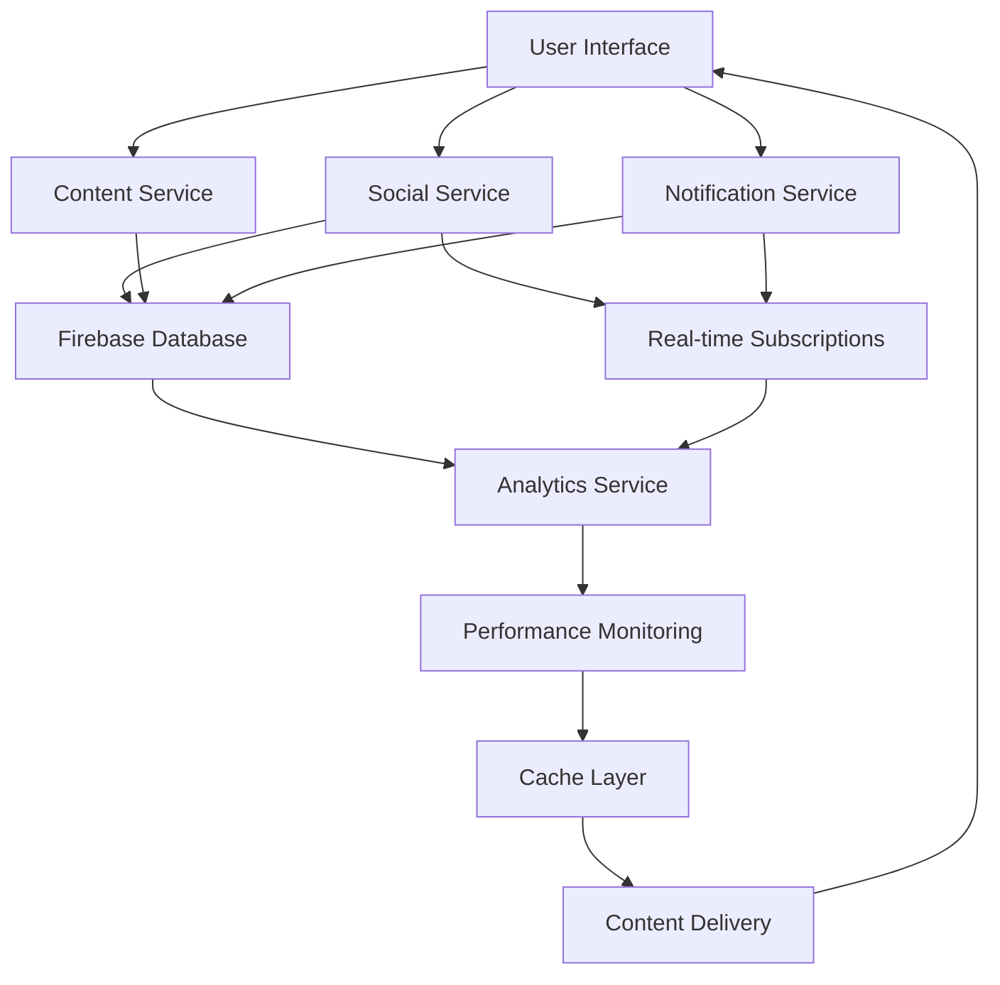

## Follow System Interactions

### Follow/Unfollow Workflow

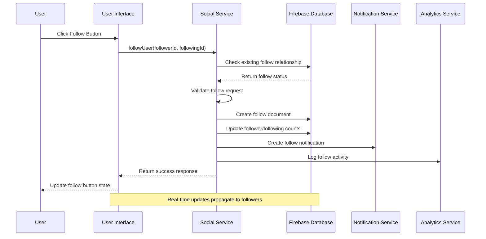

### Follow Relationship Management

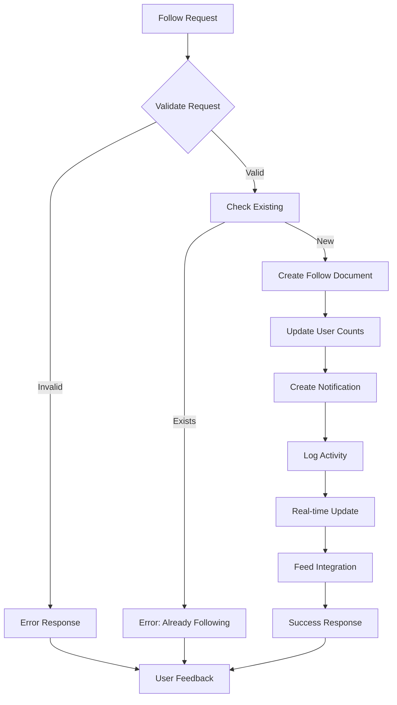

## Comments System Interactions

### Comment Creation Workflow

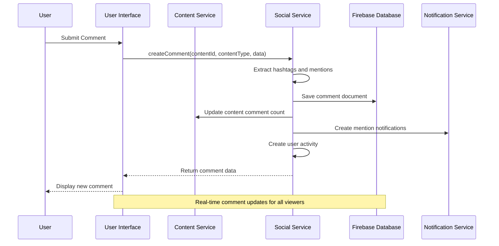

### Nested Comments (Replies)

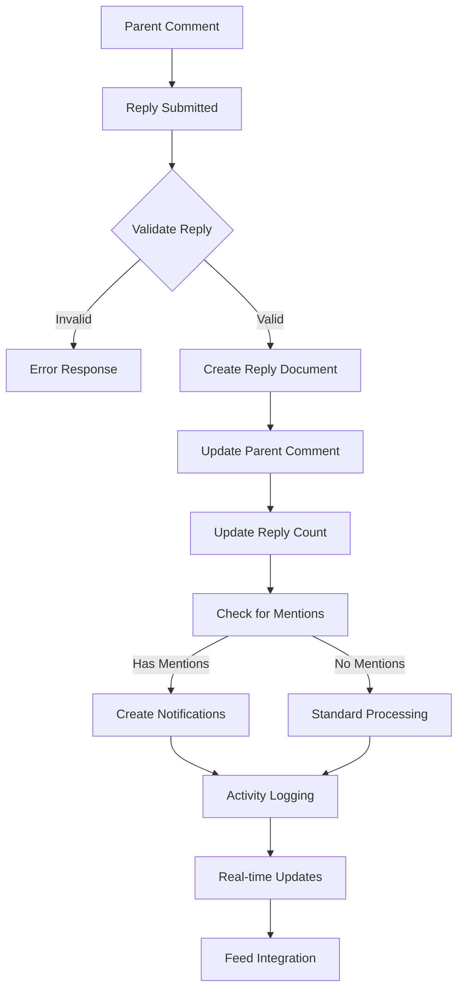

## Notifications System Interactions

### Notification Creation and Delivery

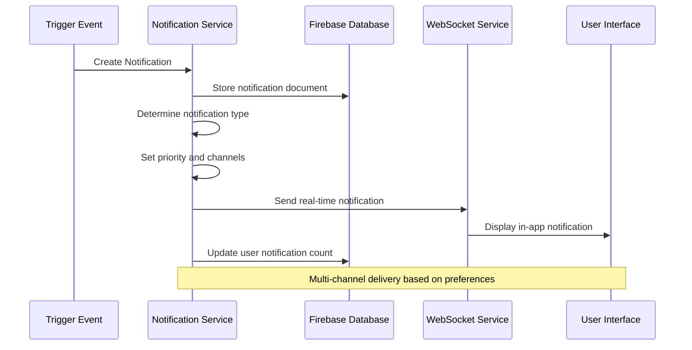

### Notification Types and Flows

| Trigger Event | Notification Type | Channels | Priority | Real-time |
|---------------|------------------|----------|----------|-----------|
| New Follow | follow | In-app, Push | Normal | Yes |
| Comment | comment | In-app, Push | Normal | Yes |
| Like | like | In-app | Low | Yes |
| Mention | mention | In-app, Push | High | Yes |
| Friend Request | friend_request | In-app, Push | High | Yes |
| Achievement | achievement | In-app, Email | Normal | No |

## Activity Feed System Interactions

### Activity Generation and Distribution

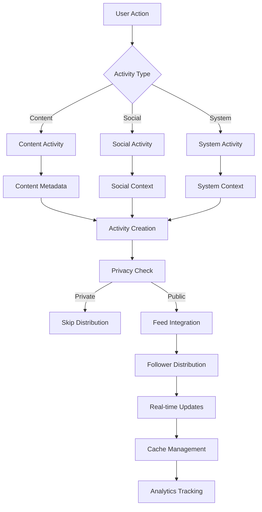

### Real-time Activity Updates

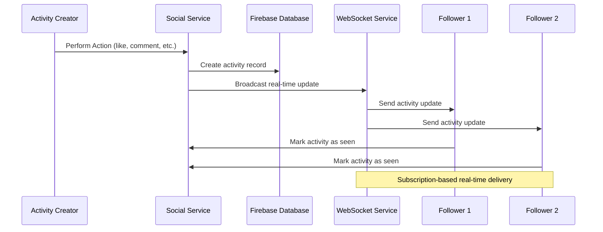

## Social Features Integration Points

### Cross-Service Dependencies

#### Content and Social Integration
- **Content Creation**: Triggers social activity generation
- **Content Engagement**: Updates social metrics and notifications
- **Content Discovery**: Uses social graph for recommendations
- **Content Moderation**: Integrates with social reporting systems

#### Notification Integration
- **Multi-channel Delivery**: In-app, push, email coordination
- **Preference Management**: User notification settings across services
- **Batch Processing**: Efficient notification grouping and delivery
- **Real-time Sync**: Instant notification delivery for live interactions

### Database Schema Interactions

#### Social Data Relationships

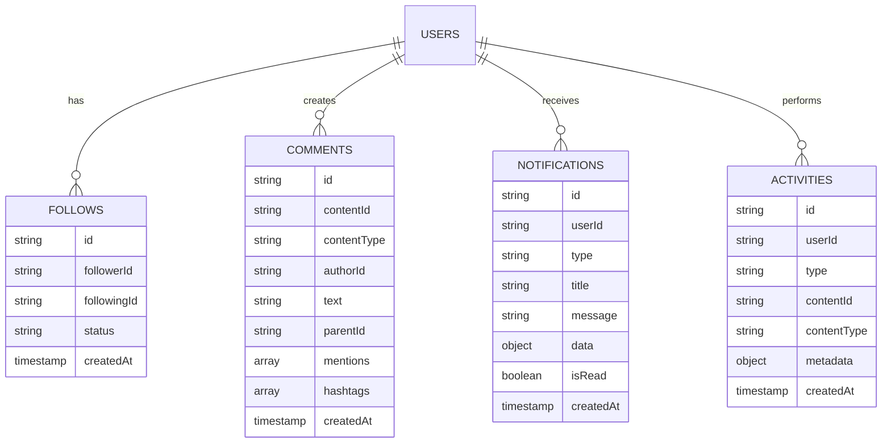

## Real-time Features Architecture

### WebSocket Connection Management

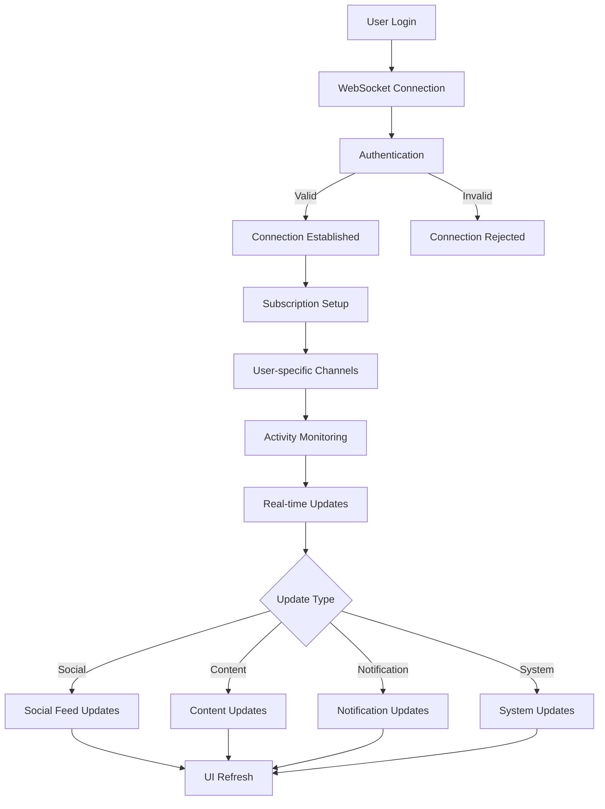

### Subscription Management

#### Real-time Subscription Types

| Subscription Type | Trigger Events | Update Frequency | Data Volume |
|------------------|----------------|------------------|-------------|
| User Activity | Follows, Comments, Likes | High | Medium |
| Notifications | All notification types | High | Low |
| Content Updates | New content, edits | Medium | High |
| Feed Changes | Algorithm updates | Low | High |
| System Status | Maintenance, outages | Low | Low |

## Performance Optimization Points

### Caching Strategies for Social Features

#### Feed Caching
- **Content Preloading**: Predict and cache likely content
- **Infinite Scroll**: Smart pagination with caching
- **Real-time Invalidation**: Update cache on content changes
- **Offline Support**: Cache critical social data

#### Notification Caching
- **Batch Delivery**: Group notifications for efficiency
- **Priority Queue**: Cache based on notification importance
- **Delivery Optimization**: Smart timing and channel selection
- **Read Status Tracking**: Efficient mark-as-read operations

### Database Query Optimization

#### Social Query Patterns
- **Follower Queries**: Optimized for follower/following lookups
- **Comment Trees**: Efficient nested comment retrieval
- **Activity Feeds**: Smart pagination and filtering
- **Notification Queries**: Real-time notification delivery

## Error Handling and Recovery

### Social Feature Error Scenarios

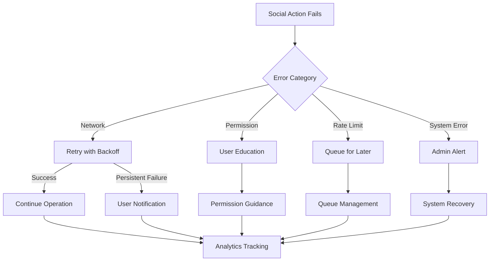

### Recovery Mechanisms

#### Automatic Recovery
- **Network Issues**: Exponential backoff for social actions
- **Temporary Failures**: Queue management for non-critical operations
- **Service Degradation**: Graceful fallbacks for social features
- **Data Consistency**: Automatic synchronization after outages

#### Manual Recovery
- **User Guidance**: Clear error messages with actionable steps
- **Alternative Actions**: Suggest workarounds for failed operations
- **Progress Preservation**: Maintain state for interrupted workflows
- **Support Integration**: Easy access to help for complex issues

## Analytics and Monitoring Integration

### Social Metrics Collection

#### Real-time Analytics
- **Engagement Tracking**: Like, comment, share interactions
- **Relationship Analytics**: Follow/unfollow patterns and trends
- **Content Performance**: Social content reach and virality
- **User Behavior**: Social feature usage patterns

#### Performance Monitoring
- **Response Times**: Social action completion speeds
- **Error Rates**: Social feature failure tracking
- **User Satisfaction**: Social experience quality metrics
- **System Health**: Social infrastructure performance

This comprehensive social features interaction documentation provides the foundation for understanding, optimizing, and scaling the platform's social functionality while ensuring excellent user experiences and system reliability.